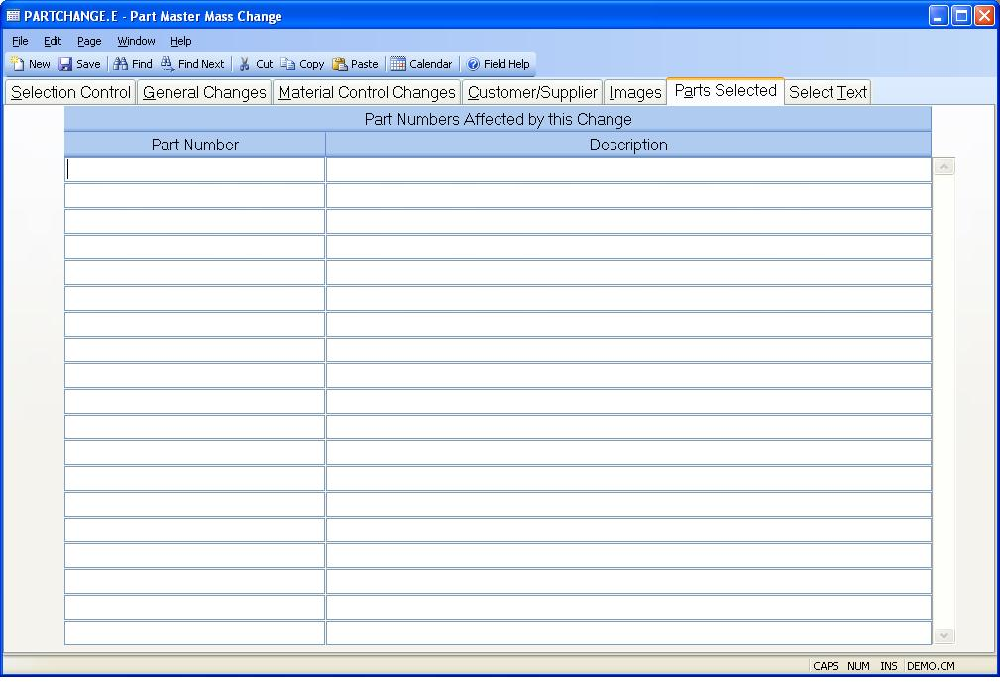

## Part Master Mass Change (PARTCHANGE.E)
<PageHeader />

## Parts Selected

| **Part No**|  This is the list of part numbers that were selected based on
the criteria entered. If no criteria was entered, or the select list was not
built, then this list will be blank. Any time the select list is rebuilt, the
list of parts will be overlayed. The list of part numbers can be changed
manually.

-  
**Desc**|

<badge text= "Version 8.10.57 " vertical="middle" />

<PageFooter />
