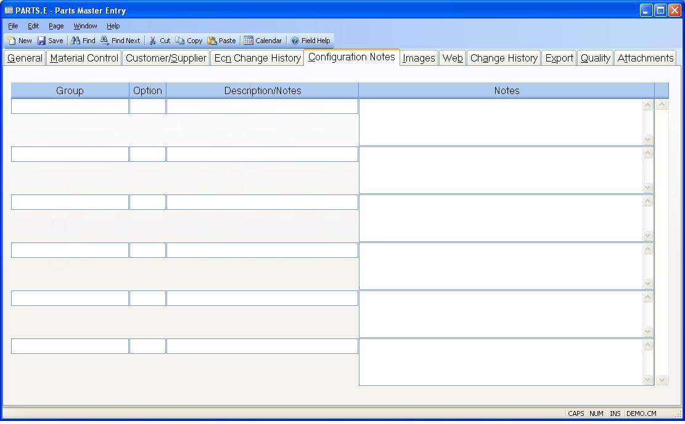

## Parts Master Entry (PARTS.E)
<PageHeader />

## Configuration Notes

| **Config Group**|  This field contains the configuration group that is
associated with the configuration notes. This field is normally loaded with
data that is collected during the configuration process that created the part.
It may be used as manually generated field for non-configured items if
desired.

-  
**Config Option**|  This field contains the configuration option that is
associated with the configuration notes. This field is normally loaded with
data that is collected during the configuration process that created the part.
It may be used as manually generated field for non-configured items if
desired.

**Config Desc**|  Contains the description of the the option that is
associated to the notes entered during the configuration process.

**Config Notes**|  Configuration notes are normally collected as part of the
configuration process and loaded when the parts record is created. They may be
used for manual notation as well.

<badge text= "Version 8.10.57 " vertical="middle" />

<PageFooter />
