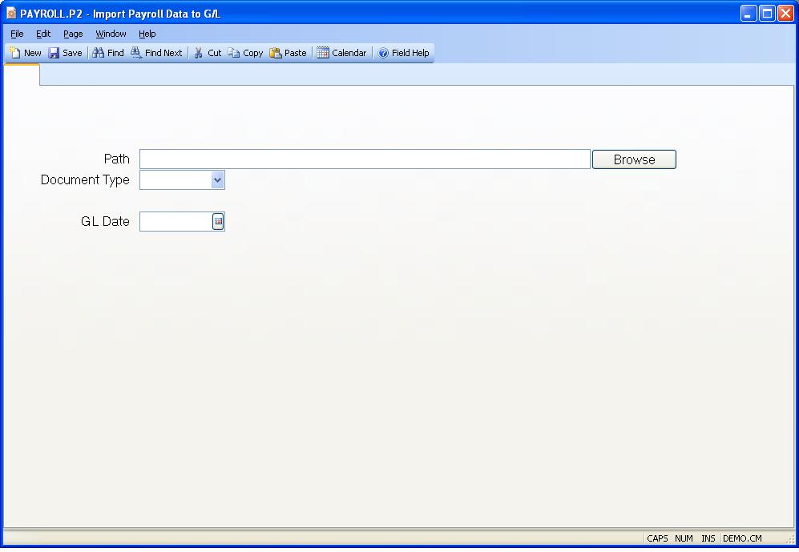

## Import Payroll Data to G/L (PAYROLL.P2)
<PageHeader />

##

| ****|

-  
**Path**|  Enter the path to the record containing the import data for the
journal entry.This is the path to a Windows file, as seen from the client PC.

**Browse**|  Click on this button to use your Windows browser to select the
record.

**Document Type**|  Enter the incoming record type.

**GL Date**|  Enter the date that will be assigned to the journal entry
created.

<badge text= "Version 8.10.57 " vertical="middle" />

<PageFooter />
