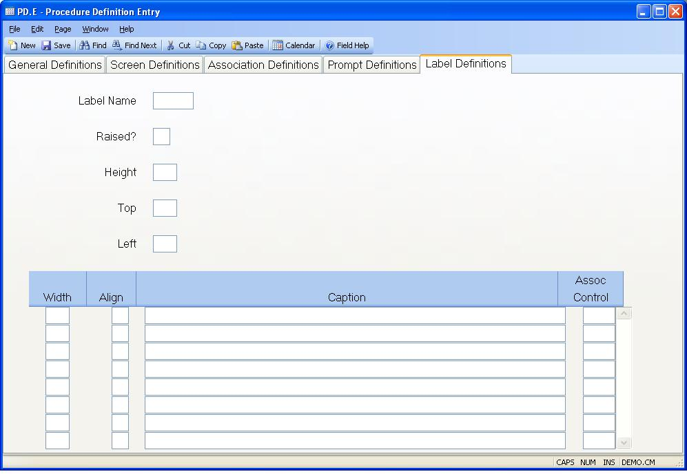

## Procedure Definition Entry (PD.E)
<PageHeader />

## Label Definitions

| **Label Name**|  Enter the name by which the label is to be identified.

-  
**Raised?**|  Enter the letter "Y" if this label is to be displayed as raised
in Windows or with the heading video attribute in character mode.

**Height**|  Enter the height (in characters) of the label.

**Top**|  Enter the character row at which the first line of the label is to
be displayed.

**Left**|  Enter the character column position at which the left side if the
label is to begin.

**Width**|  Enter the width that the associated segment of the label is to
occupy.

**Alignment**|  Enter one of the following codes which defines how the
associated caption is to be aligned in the segment:

L - Left
R - Right
C -

**Caption**|  Enter each of the caption that is to be displayed within the
associated segment. Separate each line with the tilde (~) character.

**Assoc Control**|  If the label segment is to be associated with a data entry
control, enter the name of the control in this field.

<badge text= "Version 8.10.57 " vertical="middle" />

<PageFooter />
