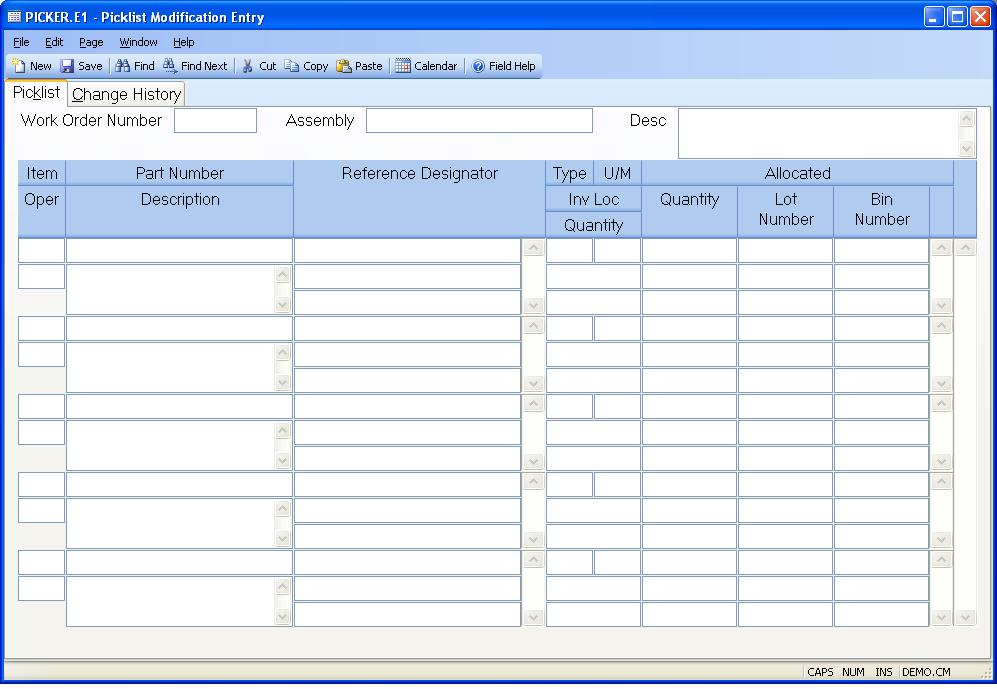

## Picklist Modification Entry (PICKER.E1)
<PageHeader />

## Picklist

| **Work order ID**|  Enter the work order number associated with the PICKER
you wish to update.

-  
**Line item**|  Line item number identifying an item to be pulled from
inventory. This is a sequential number assigned by the system. You may add or
delete any number in any sequence for the purpose of making changes to the
picklist. When the record is filed the item numbers will be reassigned as
sequential numbers.

**Part number**|  Enter the part number to be pulled from inventory.

**Description**|  The description of the part to be pulled. This data is taken
from the PARTS file and is displayed for information only. It is not stored in
the PICKER record, and it may not be changed.

**Reference Notes**|  Enter notes in reference to this part number for the
assembly. (Multiple lines are available).

**Type code**|  Enter the type code which corresponds to the use of this part
on the picker.
C - Component part pulled from stock
A - Completed assembly pulled from stock
L - Component consumed from line stock
P - Phantom assembly (Quantity usually = 0)

**UM**|  The part master inventory unit of measure for the associated
component part number.

**Inventory location**|  Enter the inventory location from which the part
number is to be pulled.

**Quantity**|  The total quantity required from this line item. Decimal
entries are permitted only if the part associated with the quantity is flagged
in the PARTS file to allow them. Negative entries will be treated as return to
stock items during the picking and backflush steps.

**Allocated Qty**|  Contains the quantity setup to be pulled if the work order
is in a released status (R), or the quantity that was pulled. If the
allocation flag in the work order record has been set to "Y" then the entries
in this field will determine what will be allocated. If the associated part
number is lot controlled then you may enter a lot number in the next field.

**Allocated Lot Number**|  If the associated part is lot controlled then you
may enter the lot number that is to be allocated.

**Allocated Bin Number**|  Enter the bin number from which the material is
being allocated. This field is only valid for bin
controlled inventory locations.

**Backflush Oper**|  If material backflush is used in the production process
you have the option of specifying when individual items on the picker are to
be consumed.
Enter the letter "F" if the part number is to be consumed when the assembly is
moved from the first step in the routing. Enter "L" if it should be consumed
when items are moved from the last step in the routing (typically when the
assembly is finished). Enter "P" if you want to pull this part via the picker
before the first operation. Or enter the specific operation number in the
routing from which the part number should be consumed when assemblies are
moved through it. If you leave this field blank or it is set to something
other than the codes described or a valid operation in the routing the letter
"L" will be assumed. These settings do not have any affect unless the work
order is designated as a backflush order.

**Assy Part**|  The assembly part number. This data is taken from the WO file
and is displayed for information only.

**Assy Desc**|  The description of the assembly part. This data is taken from
the WO file and is displayed for information only.

<badge text= "Version 8.10.57 " vertical="middle" />

<PageFooter />
