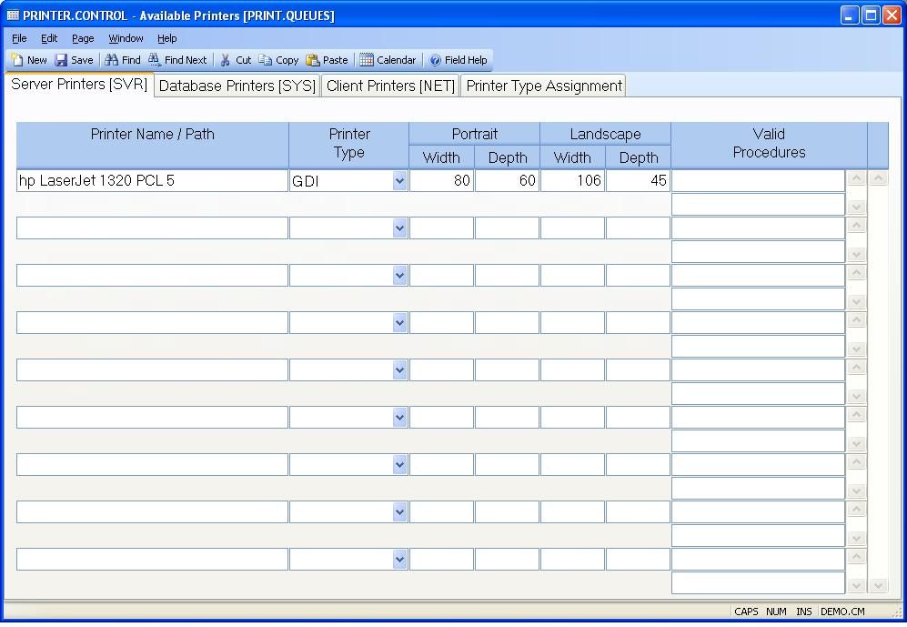

## Available Printers (PRINTER.CONTROL)
<PageHeader />

## Server Printers [SVR]

| **Control ID**|  The record ID is automatically assigned by the system to
"PRINT.QUEUES". The user does not enter the record ID.

-  
**SVR Path Name**|  Enter the full path to the name of the printer being
defined. These are printers that are accessible by the server hosting the
M3Service.

**SVR Printer Type**|  Select the printer type of the associated printer.

**SVR Portrait Width**|  Enter the width to be used when the printer is being
used with a portrait setting.

**SVR Portrait Depth**|  Enter the depth to be used when the printer is being
used with a portrait setting.

**SVR Landscape Width**|  Enter the width to be used when the printer is being
used with a landscape setting.

**SVR Landscape Depth**|  Enter the depth to be used when the printer is being
used with a landscape setting.

**SVR Valid Procedures**|  If the associated printer is to be used only for
certain processes such as form printing then you should enter the names of the
procedures which may access the printer. If any entries are made then only
those procedures will be allowed to send output to the associated printer.
Leave the field blank if the printer should be available to all procedures.

<badge text= "Version 8.10.57 " vertical="middle" />

<PageFooter />
