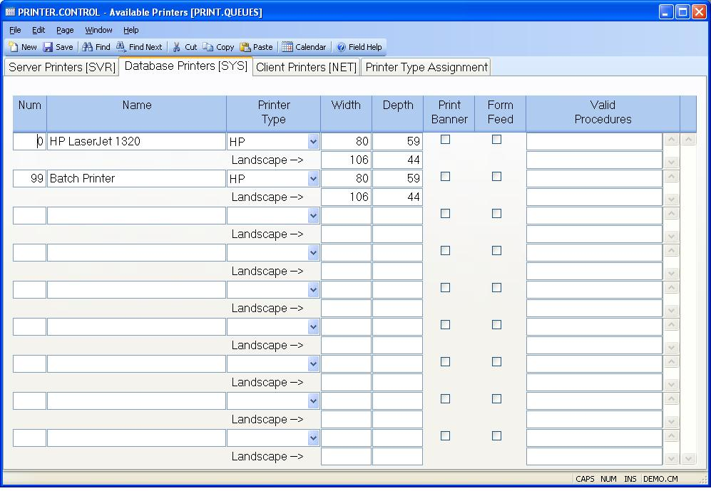

## Available Printers (PRINTER.CONTROL)
<PageHeader />

## Database Printers [SYS]

| **SYS Print Queue Number**|  Enter the printer form queue number being
defined. This should be a valid print form defined in the database system.

-  
**SYS Name**|  Enter the name or description of the printer being defined. The
name is displayed in the printer selection window on the report screens and
should provide descriptive information which the user can use to determine the
correct printer to route to. A name such as "System Line Printer" or "Shipping
Printer" provide the user with the information he needs to make a decision.

**SYS Printer Type**|  Select the printer type to be assigned to this printer.

**SYS Portrait Width**|  Enter the width to be used when the printer is being
used with a portrait setting.

**SYS Portrait Depth**|  Enter the depth to be used when the printer is being
used with a portrait setting.

**SYS Landscape Width**|  Enter the width to be used when the printer is being
used with a landscape setting.

**SYS Landscape Depth**|  Enter the depth to be used when the printer is being
used with a landscape setting.

**SYS Print Banner**|  Check this box if you want the system to print a banner
page to identify the sender of the report.

**SYS Form Feed**|  Check this box if you want the printer to send a forms
feed prior to printing the report.

**SYS Valid Procedures**|  If the associated printer is to be used only for
certain processes such as form printing then you should enter the names of the
procedures which may access the printer. If any entries are made then only
those procedures will be allowed to send output to the associated printer.
Leave the field blank if the printer should be available to all procedures.

<badge text= "Version 8.10.57 " vertical="middle" />

<PageFooter />
