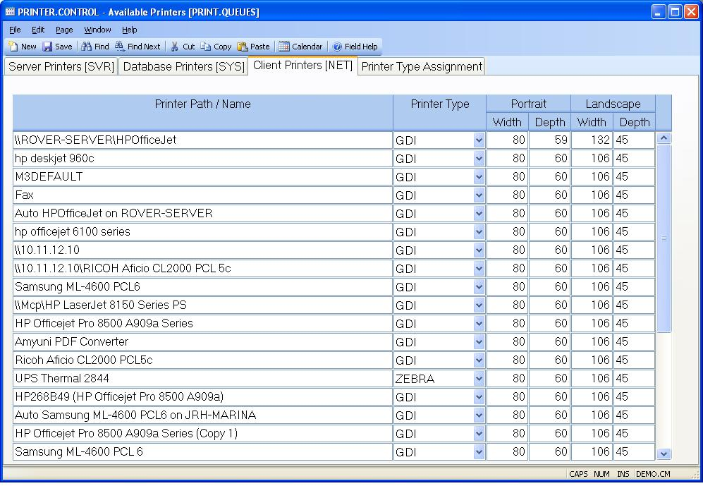

## Available Printers (PRINTER.CONTROL)
<PageHeader />

## Client Printers [NET]

| **NET Printer Path Name**|  Enter the full path name of the printer being
defined. The printer name should be from the perspective of a client computer.

-  
**NET Printer Type**|  Select the printer type to be assigned to the
associated printer. Printers visible to the client computer are automatically
added the first time they are used. The printer type value is assigned based
on the rules setup on the "Printer Type Assignment" page of this procedure. If
a match is not found the printer type is set to GDI, the most common type.

**NET Portrait Width**|  Enter the width, in characters, for the associated
printer when used in portrait mode.

**NET Portrait Depth**|  Enter the depth, in lines, for the associated printer
when used in portrait mode.

**NET Landscape Width**|  Enter the width to be used when the printer is being
used with a landscape setting.

**NET Landscape Depth**|  Enter the depth to be used when the printer is being
used with a landscape setting.

<badge text= "Version 8.10.57 " vertical="middle" />

<PageFooter />
