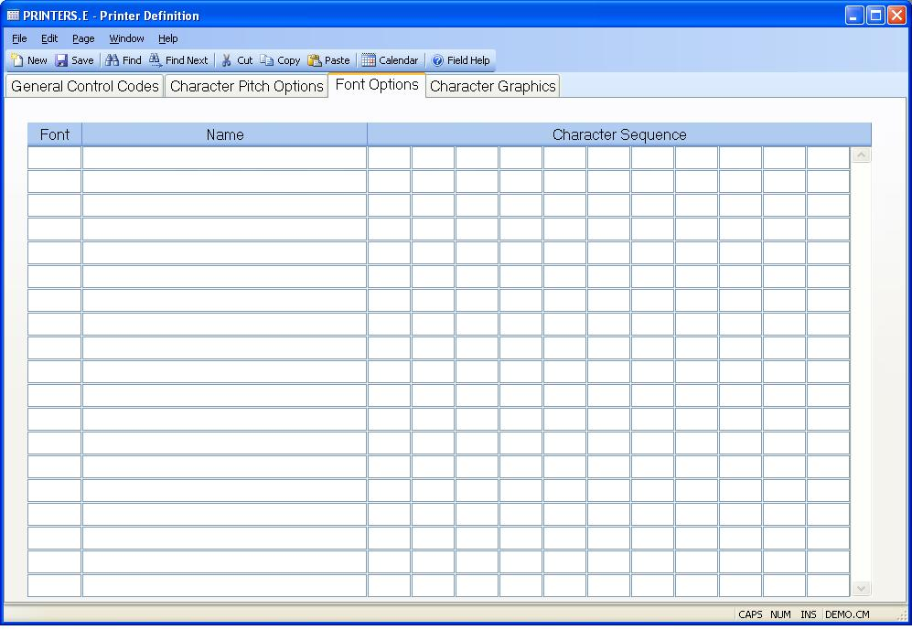

## Printer Definition (PRINTERS.E)
<PageHeader />

## Font Options

| **Font#**|  This field contains a sequential number assigned to each
available font setting. It should be sequential.

-  
**Font Name**|  Contains the name of the associated font.

**Associated Numbers**|  Enter the decimal numbers which define each of the
ASCII characters to be transmitted to
the printer to set it to the associated font.

<badge text= "Version 8.10.57 " vertical="middle" />

<PageFooter />
