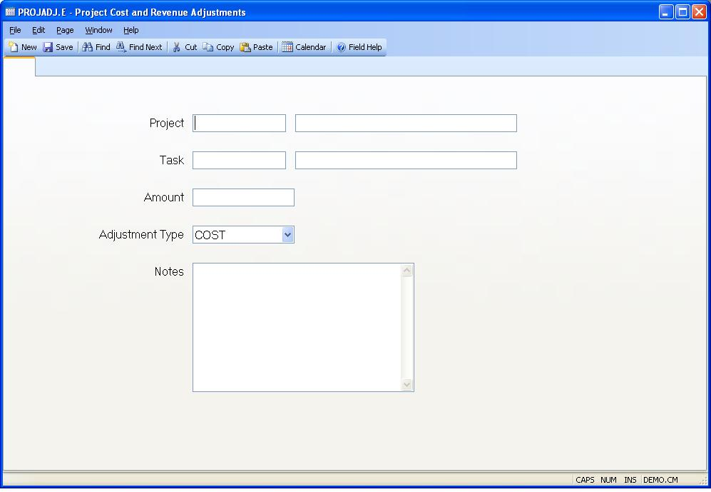

## Project Cost and Revenue Adjustments (PROJADJ.E)
<PageHeader />

##

| **PROJADJ.ID**|  The transaction ID is assigned by the system and does not
appear on the screen as a prompt. The ID is a sequentially assigned number.

-  
**Project Id**|  Enter the project that the adjustment will be applied to.

**Task Id**|  Enter the task ID associated with the project adjustment. A
lookup is provided to show all the tasks for the project.

**Amount**|  Enter the adjustment amount for the project. It can be either
positive or negative, and can be a cost adjustment or a revenue adjustment.
The amount can be two decimal place accuracy.

**Type**|  Select or input "COST" or "REVENUE" to specify if this adjustment
is to the cost or revenue portion of the project.

**Notes**|  Enter any notes to explain the reason for the adjustment.

**Project Title**|  The project title is displayed here for information only.

**Task Title**|  The task title is displayed here for information only.

<badge text= "Version 8.10.57 " vertical="middle" />

<PageFooter />
