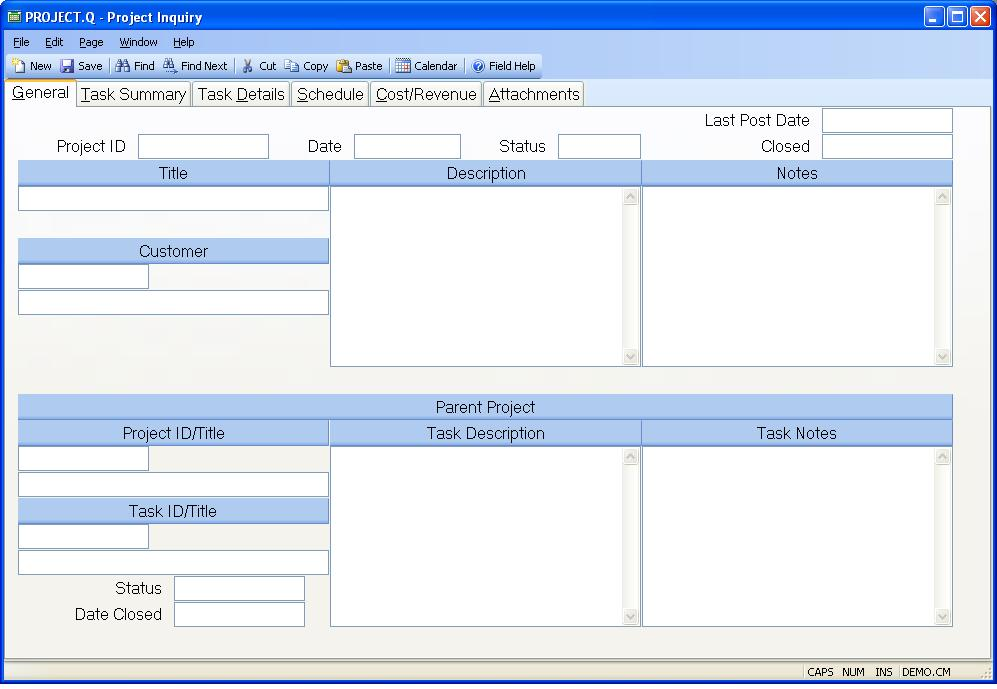

## Project Inquiry (PROJECT.Q)
<PageHeader />

## General

| **Project ID**|

-  
**Date**|  The date the project was entered.

**Status Text**|  The project status.

**Date Closed**|  The date the project was closed.

**Title**|  The project title.

**Cust Id**|  The project's customer number.

**Customer Name**|  Customer name.

**Description**|  The description of the project.

**Notes**|  Project notes.

**Parent Project**|  The parent project id.

**Parent Task**|  The task of the parent project.

**Parent Status**|  The parent project's status.

**Parent Date Closed**|  The date the parent project was closed.

**Parent Description**|  If the project you are viewing is the sub-project of
another project, then the description of the task the project is associated
with appears in this field.

**Parent Task Notes**|  If the project being viewed is a sub-project then the
notes from the task the project is assigned to are displayed in this field.

**Post Date**|  The date the project was last posted.

**Parent Project Title**|  The title of the parent project.

**Parent Task Title**|  The title of the parent task.

<badge text= "Version 8.10.57 " vertical="middle" />

<PageFooter />
