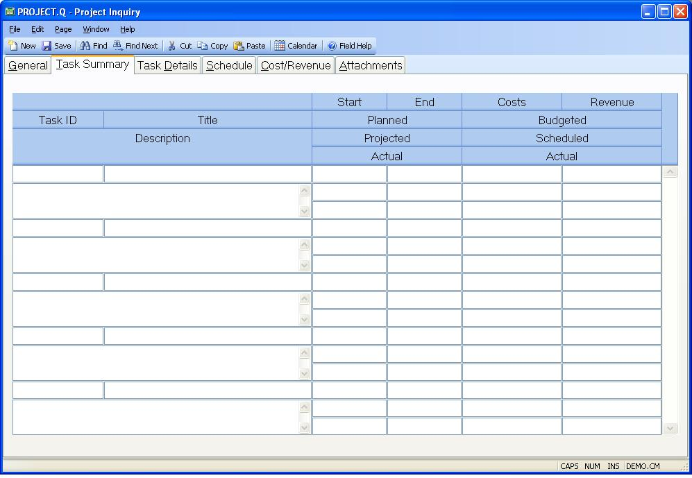

## Project Inquiry (PROJECT.Q)
<PageHeader />

## Task Summary

| **Task ID**|  The task ID.

-  
**Task Description**|  The description of the task.

**Planned Start**|  Planned Start date.

**Planned Complete**|  Planned complete date.

**Projected Start**|  Projected start date.

**Projected Complete**|  Projected complete date.

**Actual Start**|  Actual start date.

**Actual Complete**|  Actual complete date.

**Cost Budget**|  Budgeted cost as entered in [PROJECT.E](../PROJECT-E/README.md).

**Cost Schedule**|  Total scheduled costs for the project to date.

**Cost Actual**|  Total actual costs for the project to date.

**Revenue Budget**|  Budgeted revenue as entered in
[PROJECT.E](../PROJECT-E/README.md).

**Revenue Schedule**|  Total scheduled revenue for the project to date.

**Revenue Actual**|  Total actual revenue for the project to date.

**Task Title**|  The task title.

<badge text= "Version 8.10.57 " vertical="middle" />

<PageFooter />
