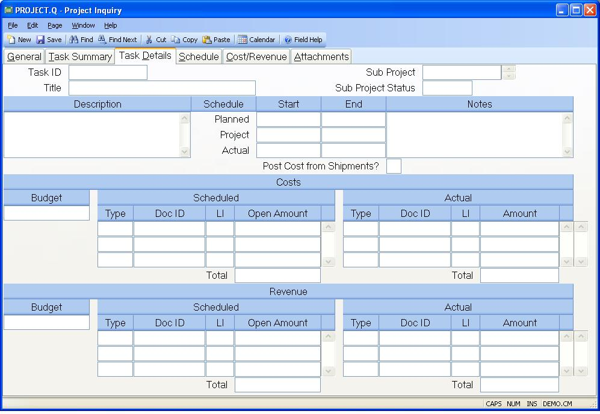

## Project Inquiry (PROJECT.Q)
<PageHeader />

## Task Details

| **Task Id**|  The task ID.

-  
**Sub Project**|

**Sub Project Status**|

**Task Desc**|  The task description.

**Planned Start**|  Planned start date.

**Projected Start**|  Projected start date.

**Actual Start**|  Actual start date.

**Plan Complete**|  Planned end date.

**Proj Complete**|  The projected completion date.

**Actual Complete**|  The actual completion date.

**Task Notes**|  Task notes.

**Post Shipment Costs?**|  This field indicates whether or not the costs
associated with shipments will be posted to the project. Shipment revenue is
always posted as actual revenue, but the costs may be double-counted if the
shipment is of a work order that is already identified to the project. In this
case, the work order costs would be posted as actual costs. For shipments of
inventory items that are not built via a work order, the costs of the shipment
should be included. This is user controlled via entry on
[PROJECT.E](../PROJECT-E/README.md).

**Cost Budget**|  The cost budget as entered in [PROJECT.E](../PROJECT-E/README.md).

**Sched Cost Type**|  The schedule cost type such as PO, POREQ.

**Sched Cost Id**|  The document number such as PO#, POREQ#, etc.

**Sched Cost Li**|  The line item associated with the document.

**Sched Cost Amt**|  The open amount associated with the document.

**Total Scheduled Cost**|  The total amount of scheduled cost.

**Act Cost Type**|  The actual cost type such as AP, WO, etc.

**Act Cost Id**|  The document number such as WO#, AP ID, etc.

**Act Cost Li**|  The line item associated with the document.

**Act Cost Amt**|  The actual cost amount associated with the document.

**Total Actual Cost**|

**Revenue Budget**|  The revenue budget as entered in
[PROJECT.E](../PROJECT-E/README.md).

**Sched Rev Type**|  The scheduled revenue type such as SO (open sales
orders).

**Sched Rev Id**|  The document number such as SO#, etc.

**Sched Rev Li**|  The line item associated with the document.

**Sched Rev Amt**|  The open amount of scheduled revenue associated with the
document.

**Total Scheduled Revenue**|  The total scheduled revenue amount.

**Act Rev Type**|  The actual revenue type such as AR, FSO, etc.

**Act Rev Id**|  The document number such as AR#, unposted Shipment#, unposted
FSO#, etc.

**Act Rev Li**|  The line item associated with the document.

**Act Rev Amt**|  The amount of the acutal revenue for this document.

**Total Actual Revenue**|  The total actual revenue.

**Task Title**|  The task title.

<badge text= "Version 8.10.57 " vertical="middle" />

<PageFooter />
