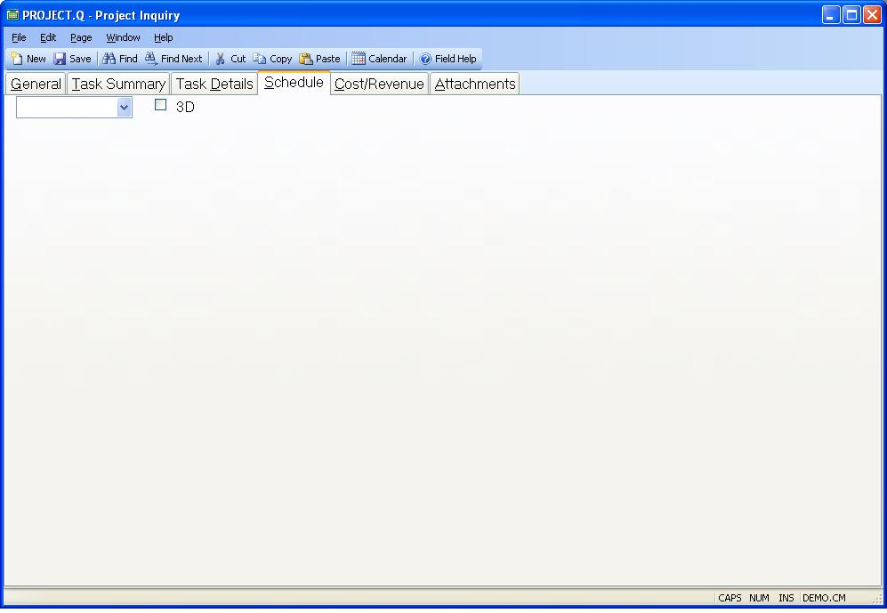

## Project Inquiry (PROJECT.Q)
<PageHeader />

## Schedule

| **Schedule**|  Select the schedule dates to be displayed in the chart.

If you select Planned the chart will contain the planned start and end dates
for each task in the project. If a planned start date is not present nothing
will appear for the task. If the planned end date is missing the system will
first attempt to use the actual end date and if that is not present it will
use the projected end date.

If you select Current the chart will contain the most current information,
beginning with the actuals for the start and end dates for each task in the
project. If actual dates are not available it will fall back to the projected
dates and the planned dates.

-  
**3D**|  Check this box to display the chart in three dimensional format.

**Schedule Chart**|  Displays a Gantt chart of the project schedule.

<badge text= "Version 8.10.57 " vertical="middle" />

<PageFooter />
