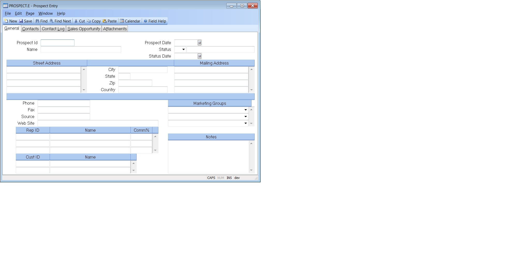

## Prospect Entry (PROSPECT.E)
<PageHeader />

## General

| **Prospect Id**|  Enter the number you wish to assign to this prospect. If
you leave this field null, a sequential number will be assigned when the
record is filed. If you want to access an existing record but you do not know
the prospect number, there is an option in the help menu for this prompt which
allows you to select the prospect by name or phone number.

-  
**Name**|  Enter the name of the prospect.

**Prospect Date**|  Enter the date this prospect was originally entered.

**Status**|  Enter the status of this prospect. The list of valid entries for
this field may be defined in [PROSPECT.CONTROL](../PROSPECT-CONTROL/README.md). If that
list is left empty, then any user defined status code may be used.

**Status Date**|  Enter the date associated to the status code.

**Address**|  Enter the business address of the prospect.

**Sort City**|  This field contains the city and is used for sorting purposes
only. The city must appear in the address section, as well.

**Sort State**|  This field contains the state and is used for sorting
purposes only. The state must appear in the address section, as well.

**Sort Zip**|  This field contains the zip code and is used for sorting
purposes only. The zip code must appear in the address section, as well.

**Sort Country**|  This field contains the country and is used for sorting
purposes only.

**Mail Address**|  Enter the mailing address of the prospect. This field will
default to be the same as the address, and can be changed if required.

**Phone**|  Enter the phone number for this prospect.

**Fax**|  Enter the prospect's FAX number.

**Source**|  This field represents the source from which this prospect came to
your attention. It is a user defined field.

**Web Site**|  Website URL associated with this prospect.

**Rep**|  Enter the rep assigned to this prospect. If you do not know the rep
number, there is an option in the help menu for this prompt which allows you
to select the rep by name.

**Rep Name**|  The rep name as is appears in the Rep file.

**Comm**|  The commission percent for the associated rep.

**Cust Id**|  This field contains the customer number(s) into which this
prospect has been converted.

**Cust Name**|  This field contains the customer name for the associated
customer ID, as it appears in the Cust file.

**Marketing Group**|  Select each of the groupings that apply to the prospect.
Groupings are used to classify prospects by various attributes and are used to
select customers for marketing compaiagns.

**Notes**|  Enter any general notes for this prospect.

**Status Desc**|  This field contains the description of the status code, as
it appears in the [PROSPECT.CONTROL](../PROSPECT-CONTROL/README.md) record.

<badge text= "Version 8.10.57 " vertical="middle" />

<PageFooter />
