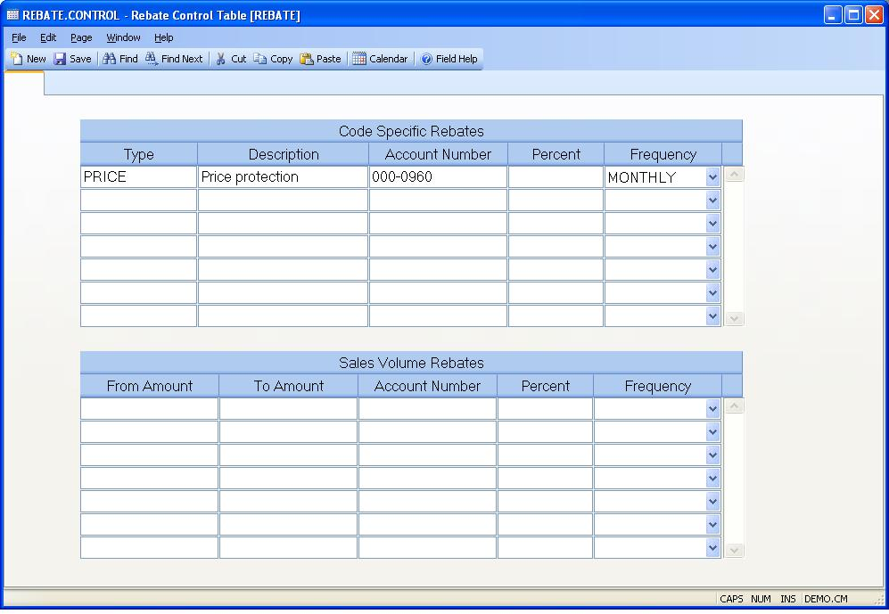

## Rebate Control Table (REBATE.CONTROL)
<PageHeader />

##

| **Control Id**|  The ID "REBATE" is automatically entered and is the only
vaild ID for this procedure.

-  
**Rebate Code**|  Enter the rebate type.

**Description**|  Enter the description of the rebate that should appear on
the invoice.

**Account Number**|  Enter the default account number that should be used when
issuing a credit for this type of rebate. A account number may, also, be
defined per customer in [CUST.E](../CUST-E/README.md).

**Percentage**|  Enter the default percentage for this rebate type. If this
field is not left blank, it will default into the customer record for you.

**Frequency**|  Enter the frequency or interval at which this rebate should be
issued.

The valid options are : INVOICE, MONTHLY, QUARTERLY, SEMI-ANNUALLY or
ANNUALLY.

**From Amount**|  Enter the starting range or sales volume the customer should
receive a rebate for. For example, you may offer a rebate to customers who
sell between 5,000.00 and 10,000.00 in a given month. This amount should
always be greater than the "to" amount for the previous entry.

You will have an option in [CUST.E](../CUST-E/README.md) to load in these defaults.

**To Amount**|  Enter the ending range or sales volume the customer should
receive a rebate for. For example, you may offer a rebate to customers who
sell between 5,000.00 and 10,000.00 in a given month. This amount should
always be greater than the from amount.

You will have an option in [CUST.E](../CUST-E/README.md) to load in these defaults.

**Account Number**|  Enter the g/l account number that should be used for this
rebate type.

**Percent**|  Enter the default percent that should be used for this type of
rebate.

**Frequency**|  Enter the frequency or interval at which this rebate should be
issued.

The valid options are : MONTHLY, QUARTERLY, SEMI-ANNUALLY or ANNUALLY.

<badge text= "Version 8.10.57 " vertical="middle" />

<PageFooter />
