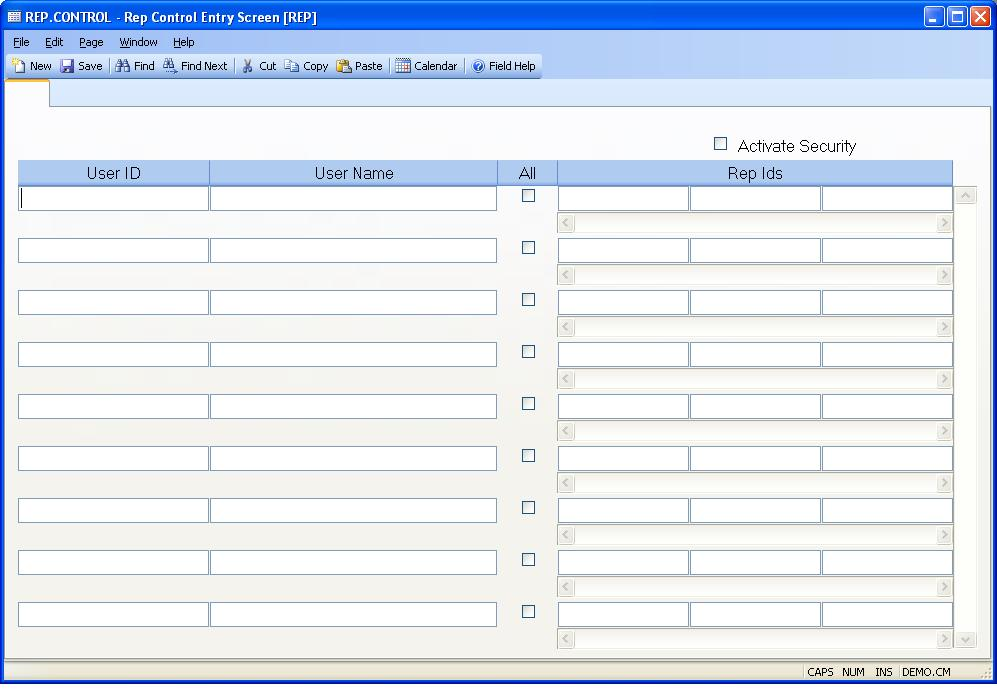

## Rep Control Entry Screen (REP.CONTROL)
<PageHeader />

##

| **ID**|  Automatically loaded with the text "CC" by the system.

-  
**User ID**|  Enter the user id(s) for the employees that will be able to run
the rep reports defined in the procedure help.

**User Name**|  Contains the name of the associated user.

**Field2**|  If this user should be allowed to view the data for all reps on
the reports defined in the procedure help, check this box.

**Field3**|  Enter the rep id(s) that this user can view on the rep reports
defined in the procedure help. If this users should be able to view data on
all reps,check the ALL option instead of entering the rep id(s) in this field.
If the ALL option is selected, the rep ids entered into this field will be
deleted when REP.CONTROL is saved.

**Field4**|  Check this box if you wish to limit the rep reports that can be
viewed by the users. The reports that will be affected by this procedure are
defined in the procedure help. Once this feature has been activated, the only
users that will be able to run these rep reports are the ones that have been
defined in tihs procedure.

<badge text= "Version 8.10.57 " vertical="middle" />

<PageFooter />
