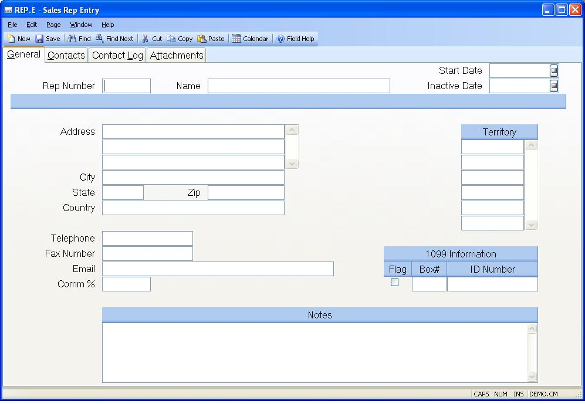

## Sales Rep Entry (REP.E)
<PageHeader />

## General

| **Rep Number**|  Enter the number of the rep to be updated, or leave the
field blank to have the system assign
a new rep number. If you want to access an existing rep record but do not know
the number,
there is an option in the help menu for this prompt which allows you to select
the rep by name.

-  
**Rep Name**|  Enter the name of the sales rep.

**Start Date**|  Enter the date this rep started working for your company. On
new records, the current date will be loaded into this field for you but can
be changed as required.

**Inactive Date**|  Enter the date this rep stooped working for your company.
After inactivating a rep, you should run a report called
[CUST.R2](../CUST-R2/README.md) to list all customers that have been assigined to this
rep. Untill the rep is removed from the customer record (i.e.
[CUST.E](../CUST-E/README.md)), it will get loaded into new quotes and sales orders.

**Address**|  Enter up to 4 lines of address.

**City**|  Enter the city.

**St**|  Enter the state code.

**Zip**|  Enter the zip code.

**Country**|  Enter the country.

**Telephone**|  Enter the phone number for this sales rep. The recommended
format is XXX/XXX-XXXX.

**Fax Number**|  Enter the phone number used to send facsimiles to the rep.
The recommended format is XXX/XXX-XXXX.

**Email**|  Enter the email address for this rep. This will be used to send
sales order change notices.

**Commission %**|  Enter the standard commission percent for this rep.

**Territory**|  Enter the territory assigned to this sales rep.

**1099**|  Check here if this rep requires 1099 reporting.

**1099 Box**|  Enter the box on the 1099 form which is to used to print forms
for this rep. This field will be used as a default into the
[CHECKS.E](../CHECKS-E/README.md) procedure.

**ID Number**|  Enter the rep's payer ID number. This may be a social security
number in the case of a sole proprietor or individual, or a federal tax ID.

**Notes**|  Enter any notes regarding the rep.

<badge text= "Version 8.10.57 " vertical="middle" />

<PageFooter />
