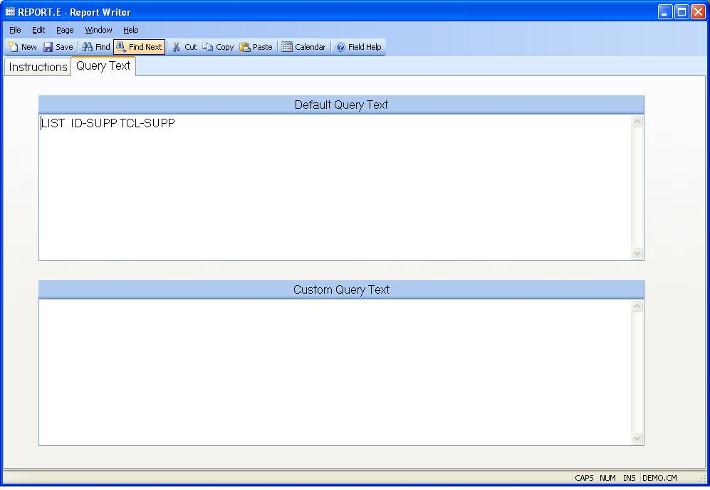

## Report Writer (REPORT.E)
<PageHeader />

## Query Text

| **Default Query Text**|  This area contains the actual query string that
will be executed when the procedure is run. If you want to modify this text
you may copy it into the custom text field and adjust it there. If there is
anything present in the custom text field it will be executed instead of the
default text in this field.

-  
**Custom Query Text**|  If you want to adjust the default query text that is
executed when the report is run, you may enter the text in this field. If
desired you may copy the default text and paste it into this field for
modification. If this field is empty the default text will be used.

<badge text= "Version 8.10.57 " vertical="middle" />

<PageFooter />
