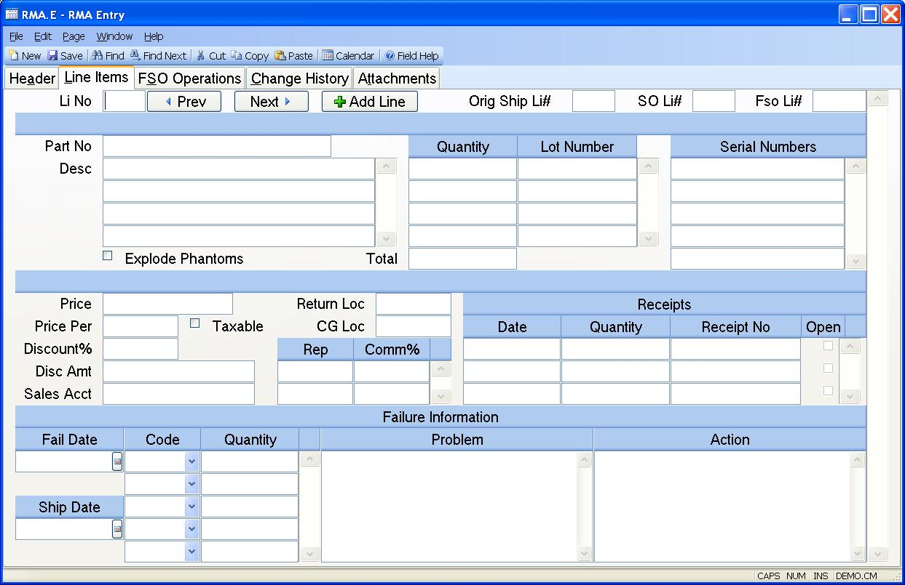

## RMA Entry (RMA.E)
<PageHeader />

## Line Items

| **Line Item#**|  Enter a number to identify the item being returned.
Sequential numbers beginning with 1 are generally used.

-  
**Original Ship Li#**|  If a shipment number has been identified then you must
enter the line item number from the original shipment associated with the item
being returned in this field.

**Sales Order Li#**|  If a sales order number has been identified then you
must enter the line number on the sales order associated with the item being
returned.

**Fso Li**|  If a field service order number has been identified then you must
enter the line number on the field service order associated with the item
being returned.

**Part Number**|  This field contains the part number of the item being
returned. If a sales order line number is present then the contents of theis
field is preloaded and may not be changed. If not you may enter the number of
the part being returned. If you do not know the part number you may enter the
model number. The system will then load the correct part number.

**Description**|  Contains the description of the item being returned.

**Pull Qty**|  Enter the quantity being returned. If this part is lot
controlled, you may enter multiple lot/quantity combinations.

**Lot No**|  If the part number being returned is lot controlled and you know
the lot numbers being returned, enter them in this field.

**Quantity**|  The total quantity being returned. This total is displayed for
reference only and cannot be changed.

**Serial Numbers**|  If you know the serial numbers of the items that will be
returned you may enter them in this field.

**Price**|  If a sales order number is present the price will be preloaded. In
either case you may enter or change the price as required. The price is used
in the calculation of the credit to the customer account.

**Price Per**|  If a sales order number is present the price per will be
preloaded. In either case you may enter or change the price per as required.
It is used in conjunction with the price in the calculation of the credit to
the customer account.

**Taxable**|  Check here if the associated item was taxed when invoiced. If
checked and you chose to credit the customer account, the tax amount will be
calculated and included in the credit amount.

**Discount%**|  Enter the percentage discount provided when the items were
originally invoiced. This is used to calculate the discount amount. You may
choose to skip this field and enter the discount amount directly.

**Discount Amount**|  Enter the per unit discount amount provided on the
original invoice to the customer. This amount is used in the calculation of
the credit amount.

**Sales Account#**|  Enter the sales account number to be affected by the
return of the items.

**Return Loc**|  Enter the inventory location into which the items are to be
posted upon receipt.

**CG Loc**|  Enter the cost of goods location to be credited upon receipt of
the items.

**Rep**|  Enter each rep who was credited with a commission for the associated
item. The commission percent is entered in the associated field. If you chose
to credit the customer account then a debit will be posted to the commissions
for the reps. If you do not know the rep number, there is an option in the
help menu for this prompt which allows you to select the rep by name.

**Comm%**|  Enter the commission percent associated with the rep.

**Date Received**|  Displays the dates of any receipts made against the
assocaiated RMA line number. The field is for information only and maynot be
changed.

**Qty Received**|  Displays the quantity received on the associated date for
the line item. This field is for information only and may not be changed.

**Receipt No**|  Displays the number assigned to the receipt on the associated
date. This information may not be changed in this form.

**Open Receipt**|  This box is checked when the associated receipt is still
open. Open receipts are receipts with a status of "R" or "received".

**Fail Date**|  Enter the date (if applicable) on which the units failed.

**Ship Date**|  Enter the date on which the items being returned were
originally shipped.

**Fail Code**|  If you know some or all of the failure codes to be applied to
the units being returned, you may enter them here. These codes will be loaded
into the receipt where they may be changed as required.

**Fail Qty**|  Enter the number of items exhibiting the failure denoted by the
associated failure code.

**Line Notes**|  Enter a description of the problem with the items being
returned.

**Corr Action**|  Enter notes describing the action taken correct the problem
with the returned items.

**Explode Phantom**|  Check this box if you want to receive the components of
phantom assemblies when receiving a line item that is a phantom part. If
unchecked, then the phantom assembly will be received as a normal part number.
This setting will default from the [MRK.CONTROL](../MRK-CONTROL/README.md) entry but
can be changed.

**Prev**|  Press this button to go to the previous line item.

**Next**|  Press this button to go to the next line item.

**Add Line**|  Press this button to add a new line item.

<badge text= "Version 8.10.57 " vertical="middle" />

<PageFooter />
