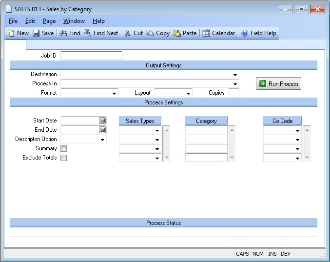

## Sales by Category (SALES.R13)
<PageHeader />

##

| **Job ID**|  Enter a unique ID if you wish to enter and save the parameters
to this procedure for future use. If you only need to run the procedure and do
not want to save your entry then you may leave this field empty.

-  
**Destination**|  Select the destination for the output from this procedure.

**Process**|  Select the method to be used for processing the report.
Foreground is always available and must be used when output is directed to
anything other than a system printer (i.e. printers spooled through the
database on the host computer.) Depending on your setup there may be various
batch process queues available in the list that allow you to submit the job
for processing in the background or at a predefined time such as overnight. A
system printer must be specified when using these queues.

**Format**|  Select the format for the output. The availability of other
formats depends on what is allowed by each procedure. Possible formats include
Text, Excel, Word, PDF, HTML, Comma delimited and Tab delimited.

**Layout**|  You may indicate the layout of the printed page by specifying the
appropriate setting in this field. Set the value to Portrait if the page is to
be oriented with the shorter dimension (usually 8.5 inches) at the top or
Landscape if the longer dimension (usually 11 inches) is to be at the top.
Portrait will always be available but Landscape is dependent on the output
destination and may not be available in all cases.

**Copies**|  Enter the number of copies to be printed.

**Run Process**|  Click on the button to run the process. This performs the
save function which may also be activated by clicking the save button in the
tool bar or pressing the F9 key or Ctrl+S.

**Start Date**|  Enter the range start date within which the shipment date
must fall to be selected for this report.

**End Date**|  Enter the end range date within which the shipment date must
fall to be selected for this report.

**Description Option**|  Select one of the following entries. If no entry is
made in this field, the part description will not appear on the report.

1\. None - No description prints.
2\. Short - Prints the first 25 characters of the description.
3\. Extended - Prints the first 500 characters of the description.

**Summary**|  To print a summary report, showing only totals for the category,
check this box.

**Exclude Totals**|  Check this box to exclude the total lines from the
report.

**Sales Type**|  If you wish to run this report for specific sales types,
enter the types you wish to include in this field. If no entry is made in this
field, all types will be included. The valid types are:

1\. AR - Entries created via [AR.E](../AR-E/README.md).
2\. FSO - Entries created from a field service order.
3\. PSO - Entries created from point of sale orders.
4\. RMA - Entries created from an RMA receipt.
5\. SHIP - Entries created from a sales order shipment.

**Category**|  If you only want to list the sales for a particular category
then enter the category in this field. To include all categories, leave the
field blank.

**Co Code**|  Enter the company codes you wish to appear on this report. If
left blank all company codes will be included.

**Last Status Message**|  Contains the last status message generated by the
program.

**Last Status Date**|  The date on which the last status message was
generated.

**Last Status Time**|  The time at which the last status message was
generated.

<badge text= "Version 8.10.57 " vertical="middle" />

<PageFooter />
