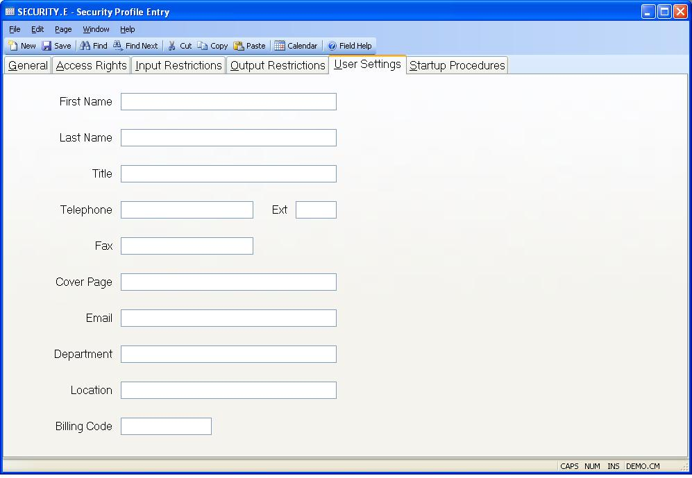

## Security Profile Entry (SECURITY.E)
<PageHeader />

## User Settings

| **First Name**|  Enter your first name.

-  
**Last Name**|  Enter your last name.

**Title**|  Enter your title or position in the company.

**Telephone**|  Enter your company telephone number. This entry is used in
areas such as the fax cover sheet. If left blank the company telephone number
defined in CO.CONTROL will be used.

**Ext**|  If applicable enter your telephone extension.

**Fax**|  Enter the fax number that should be used when someone is sending you
a fax. If left blank the fax number for the company defined in the CO.CONTROL
procedure will be used.

**Fax Cover Page**|  You may specify a default cover page to be pre-selected
when sending a fax in this field. The name entered must be a valid cover page
name available to the fax modem or server you are using.

**Email Address**|  Enter your email address in this field.

**Department**|  Enter the department you are associated with.

**Location**|  Enter the location of your office or work place within the
company. In some cases this may be a mail stop number.

**Billing Code**|  If your company tracks usage for services such as faxing
then enter the billing code to be charged when you utilize these services.

<badge text= "Version 8.10.57 " vertical="middle" />

<PageFooter />
