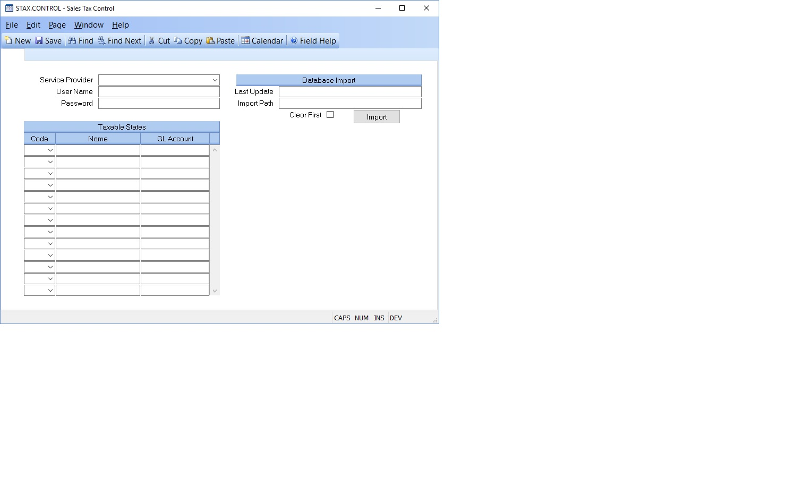

## Sales Tax Control (STAX.CONTROL)
<PageHeader />

##

| **Control ID**|  Automatically loaded with "STAX".

-  
**Service Provider**|  Select the service provider being used to obtain sales
tax rates.

**User Name**|  Enter the user name to be used for obtaining sales tax
information from the web service. This is usually assigned by the service
provider.

**Password**|  Enter the password to be used for obtaining sales tax
information from the web service provider. This is usually defined by the
service provider.

**State Code**|  Select the two digit state code for every state in which you
are required to collect sales tax.

**Name**|  Enter the name of the associated state.

**Account Number**|  Enter the general ledger account number to be used for
capturing sales tax for the associated state.

**Last Database Update**|  Displays the last date and time the database was
updated. This applies only to service providers that use a local database such
as Tax Data Systems Database.

**Import Path**|  Enter the path to the file containing the tax information
that is to be imported into the database. The path needs to be from the
viewpoint of the server hosting M3.

**Import**|  Click this button to import the sales tax imformation into the
database.

<badge text= "Version 8.10.57 " vertical="middle" />

<PageFooter />
