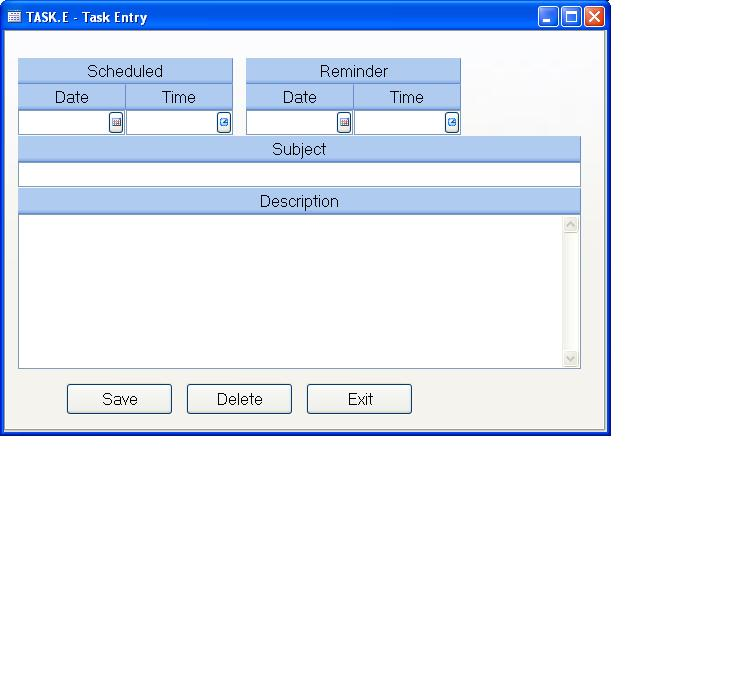

## Task Entry (TASK.E)
<PageHeader />

##

| **Task Id**|  The record id is automatically loaded by the process that
launches this procedure.

-  
**Schedule Date**|  Enter the date on which the task is to be addressed.

**Schedule Time**|  Enter the time at which the task is to be addressed.

**Reminder Date**|  If you want the system to issue a reminder about the task,
enter the date on which the reminder should be made.

**Reminder Time**|  If you want the system to issue a reminder about the task,
enter the time at which the reminder should be made.

**Subject**|  Enter a brief description of the task.

**Detail**|  Enter a complete description of the task.

**Save**|  Click this button to save the information entered.

**Delete**|  Click this button to delete the task.

**Exit**|  Click this button to close the the task without saving any changes
made.

<badge text= "Version 8.10.57 " vertical="middle" />

<PageFooter />
