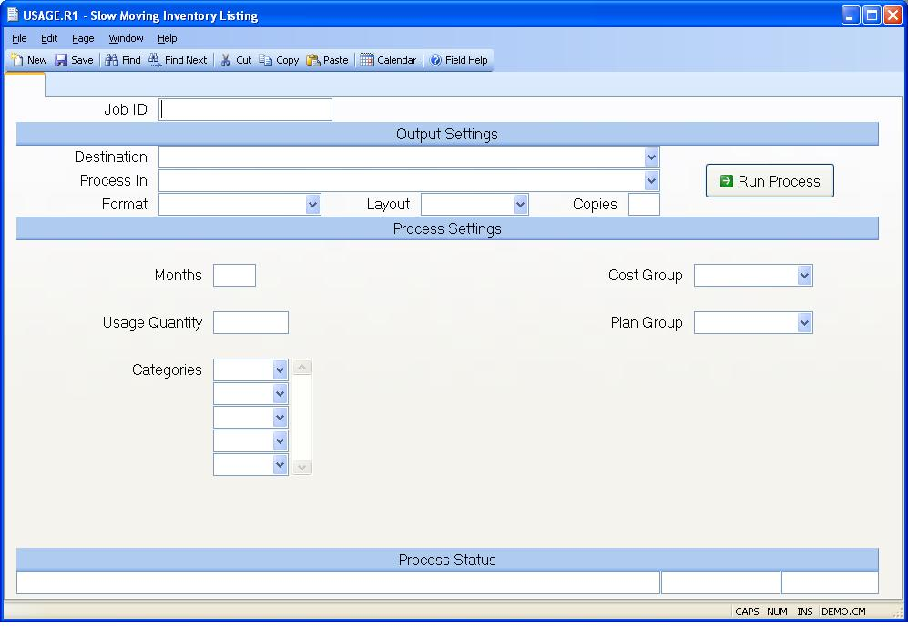

## Slow Moving Inventory Listing (USAGE.R1)
<PageHeader />

##

| **Job ID**|  Enter a unique ID if you wish to enter and save the parameters
to this procedure for future use. If you only need to run the procedure and do
not want to save your entry then you may leave this field empty.

-  
**Destination**|  Select the destination for the output from this procedure.

**Process**|  Select the method to be used for processing the report.
Foreground is always available and must be used when output is directed to
anything other than a system printer (i.e. printers spooled through the
database on the host computer.) Depending on your setup there may be various
batch process queues available in the list that allow you to submit the job
for processing in the background or at a predefined time such as overnight. A
system printer must be specified when using these queues.

**Format**|  Select the format for the output. The availability of other
formats depends on what is allowed by each procedure. Possible formats include
Text, Excel, Word, PDF, HTML, Comma delimited and Tab delimited.

**Layout**|  You may indicate the layout of the printed page by specifying the
appropriate setting in this field. Set the value to Portrait if the page is to
be oriented with the shorter dimension (usually 8.5 inches) at the top or
Landscape if the longer dimension (usually 11 inches) is to be at the top.
Portrait will always be available but Landscape is dependent on the output
destination and may not be available in all cases.

**Copies**|  Enter the number of copies to be printed.

**Run Process**|  Click on the button to run the process. This performs the
save function which may also be activated by clicking the save button in the
tool bar or pressing the F9 key or Ctrl+S.

**Months**|  Enter the number of months of usage you want to include in
determining if an item is slow moving. For example, if you enter "6" the most
recent six months usage history will be totaled to determine if the item
qualifies as a slow moving part.

**Usage Quantity**|  Enter the quantity to be used in determining if an item
is slow moving. For example, if you enter "0" (zero) then only those parts
with no usage within the number of months specified will be included in the
report. If you enter "10" then anything with usage less than or equal to ten
will be included.

**Categories**|  Enter all of the part categories to be included in the
listing. If you leave this field blank then all categories will be included.

**Cost Group**|  Enter the cost group which will be validated against
[INV.CONTROL](../INV-CONTROL/README.md) and used to determine the cost method for
calculating inventory cost on this report. Leave this field empty to use the
cost group assigned to the inventory location(s). This would apply only if you
have multiple cost groups.

**Plan Group**|  Enter the planning group which you wish to use for this
report. This field will control the MRP quantities and the available inventory
locations to use.

**Last Status Message**|  Contains the last status message generated by the
program.

**Last Status Date**|  The date on which the last status message was
generated.

**Last Status Time**|  The time at which the last status message was
generated.

<badge text= "Version 8.10.57 " vertical="middle" />

<PageFooter />
