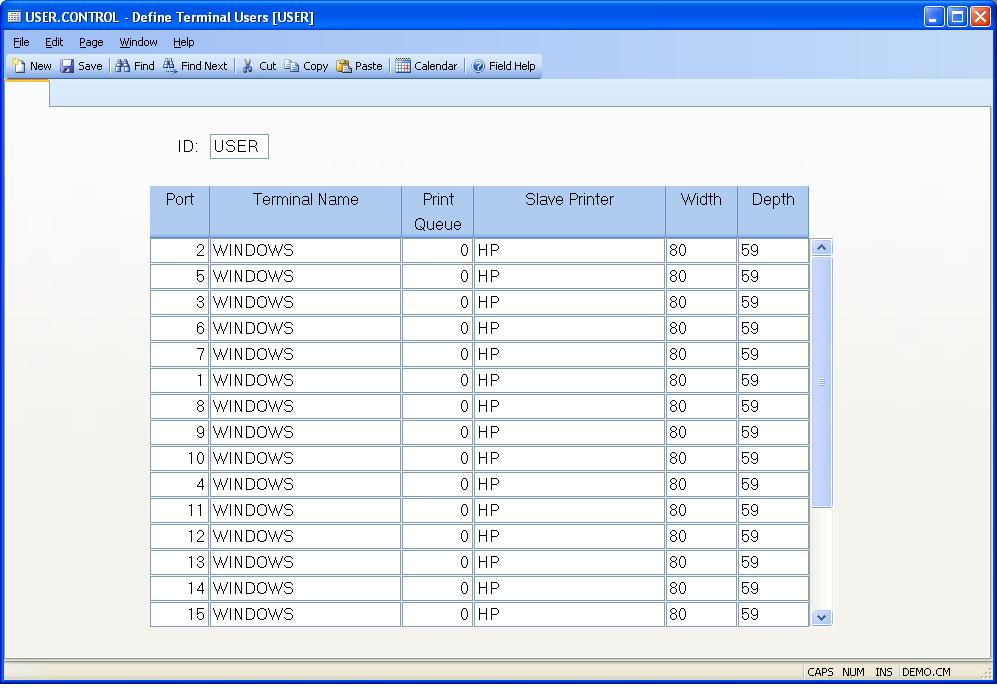

## Define Terminal Users (USER.CONTROL)
<PageHeader />

##

| **Record ID**|  Contains the ID of the record which is always defaulted by
the system as "USER".

-  
**User Number**|  Enter the system user number being defined. This number
represents the serial line to which a given terminal is connected.

**Terminal ID**|  Enter the number which defines the terminal being used with
the associated user number. This must be the ID of a record in the TERMINALS
file.

**Print Queue**|  Enter the number which identifies the print queue normally
used by this user.

**Printer ID**|  Enter the name of the printer, as defined in the PRINTERS.E
procedure, that is attached to the associated terminal as a slave printer.

**Slave Printer Width**|  Enter the width (number of character across the
page) of the slave printer attached to this user's terminal. This will be used
to set the terminal characteristics when output is sent to the slave printer.

**Slave Printer Depth**|  Enter the depth (number of lines per page) for the
slave printer attached to this user's terminal. This will be used to set the
terminal when output is directed to the slave printer.

<badge text= "Version 8.10.15 10/27/14" vertical="middle" />

<PageFooter />
