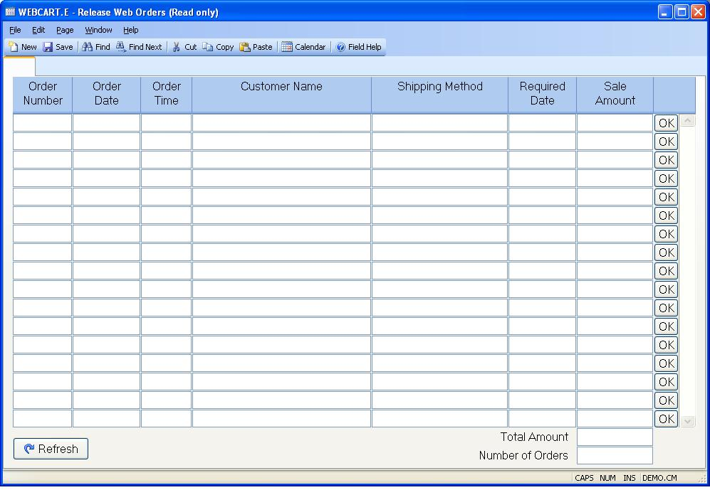

## Release Web Orders (WEBCART.E)
<PageHeader />

##

| **ID**|  This field is a required record key on the form but is not used.

-  
**Order Number**|  Displays the order number for each pending web order.

**Order Date**|  Displays the date on which the order was placed.

**Order Time**|  Displays the time at which the order was placed.

**Customer Name**|  Displays the name of the customer that placed the order.

**Shipping Method**|  Displays the shippping method chosen by the customer.

**Required Date**|  Displays the date the customer specified as the required
date for the order.

**Sale Amount**|  Displays the dollar value of the order.

**OK**|  Click this button to release the associated web order.

**Refresh**|  Click this button to refresh the list of web orders.

**Total Amount**|  Displays the total dollar amount of all pending web orders.

**Number of Orders**|  Displays the number of pending web orders.

<badge text= "Version 8.10.57 " vertical="middle" />

<PageFooter />
