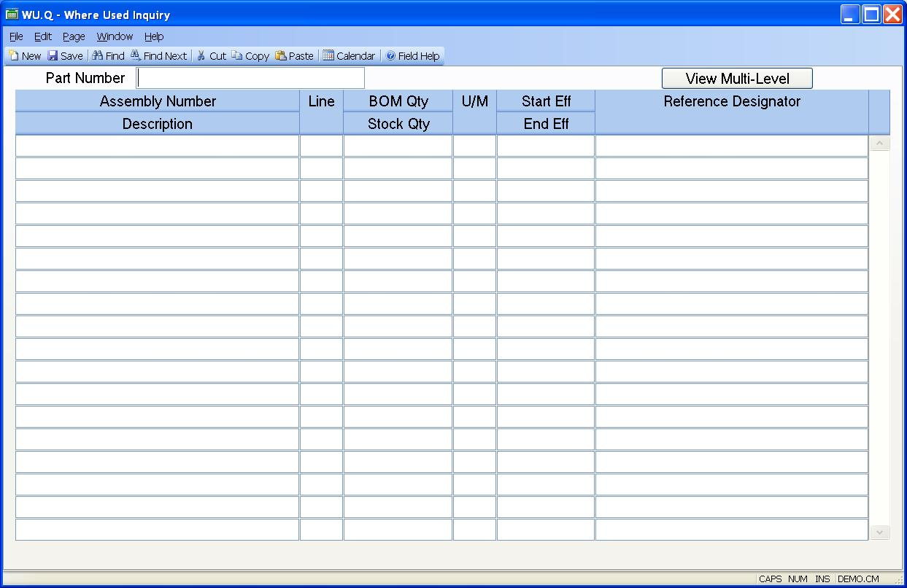

## Where Used Inquiry (WU.Q)
<PageHeader />

##

| **Part Number**|  Enter the part number you wish to inquire against, or a
model number, category or manufacturer part number.

-  
**Assembly/Description**|  This column contains the assembly numbers and the
assembly descriptions on which the part number is used.

**Item/Quantity**|  Contains the line item numbers of the part used on the
associated assembly.

**BOM Qty**|  Contains the quantity of the part used on the associated
assembly in BOM U/M terms and the quantity of the part in stock U/M terms.

**UM**|  This is the BOM Unit of measure for the component part and the stock
unit of measure for the component part.

**Start/End Effectivity**|  Displays the start and end effectivity for the
part as defined on the associated assembly.

**Reference Designator**|  Contains the reference designator information
associated with the assembly line item.

**View Multi-Level**|  Click this button to view the where used data in a grid
that allows you to expand the entries up through higher levels in the where
used structure.

<badge text= "Version 8.10.57 " vertical="middle" />

<PageFooter />
