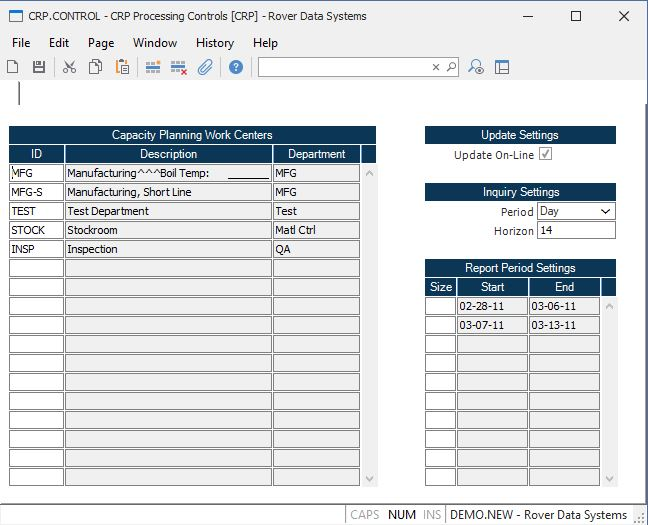

##  CRP Processing Controls (CRP.CONTROL)

<PageHeader />

##

**Control ID** The ID to this record is "CRP" and is loaded automatically by
the system.  
  
**Work Centers** Enter the work centers whose capacity is to be maintained and
included in the CRP calculation. Note: If you have been using the CRP system
and  
decide to change the work centers defined in  
this field, you must run the [ CRP.P1 ](../../../MFG-PROCESS/CRP-P1/README.md) process   
to reset the capacity files.  
  
**Description** Displays the description of each work center.  
  
**Department** Displays the department each work center is associated with.  
  
**Update On-Line** Check this box if capacity is to be updated on-line as work orders are added or changed. If you choose not to update on-line then the capacity files can be regenerated on an appropriate basis by the [ CRP.P1 ](../../../MFG-PROCESS/CRP-P1/README.md) process. The online update adds demand as it created or checged through work orders. It does not decrease demand based on shop activity therefore it is recommended that the [ CRP.P1 ](../../../MFG-PROCESS/CRP-P1/README.md) regeneration process be run nightly.   
  
**Inquiry Period** Select the default entry to be used for the period setting in the Capacity Requirement Planning Inquiry ( [ CRP.Q ](../../../MFG-REPORT/CRP-Q/README.md) ). If not set "Day" will be used.   
  
**Inquiry Horizon** Enter the default entry to be used as the number of periods to display in the Capacity Requirements Planning Inquiry ( [ CRP.Q ](../../../MFG-REPORT/CRP-Q/README.md) ). If no entry is made 13 will be used as the default.   
  
**Period Size** Enter the number of days to be used as the length of each
period on the CRP horizontal report. For example, to get weekly buckets you
would enter 7 for 7 days in a week, for as many weeks as are to appear on the
report (i.e. horizon). You may also enter a different number of days for each
period. This allows you to setup a situation such as having the first 8
periods be weekly followed by a 30 day period and a 90 day period.  
  
**Period Start** Displays the start dates calculated for each period during the last update from the [ CRP.P1 ](../../../MFG-PROCESS/CRP-P1/README.md) procedure.   
  
**Period End** Displays the end dates calculated for each period during the last update from the [ CRP.P1 ](../../../MFG-PROCESS/CRP-P1/README.md) procedure.   
  
  
<badge text= "Version 8.10.57" vertical="middle" />

<PageFooter />