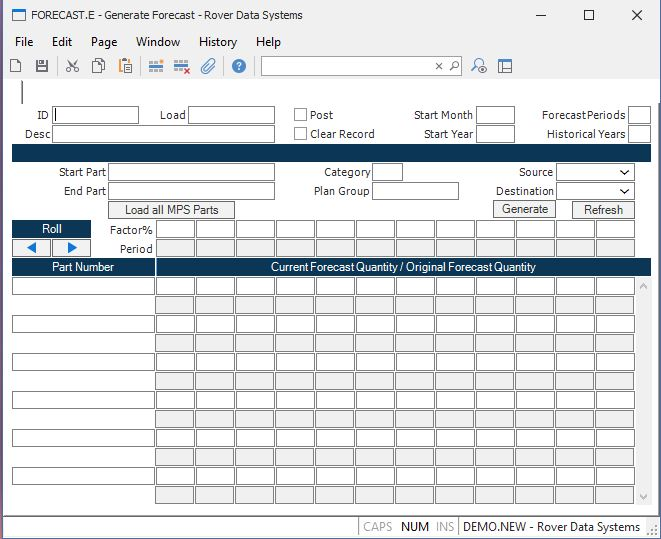

##  Generate Forecast (FORECAST.E)

<PageHeader />

##

**ID** This field contains the ID assigned to this forecast record. If you are
entering a new forecast, leave this field empty and a new ID will be assigned
when saved.  
  
**Load** If you wish to load in the data from an existing forecast record,
enter in the forecast id in this field.  
  
**Desc** Enter the description of this forecast record. This information will
be available when accessing existing forecast records.  
  
**Post** If you wish to update the destination file with the information below
when the record is saved, check this box.  
  
**Clear Record** This option is only used when the record is posted. If this
option is selected, all existing entries in the ID, MS or SF records for the
part numbers referenced below will be deleted before the record is updated
with the current entries in this forecast id. This option should not be
selected if you are using multiple forecast records to update the same set of
items or the existing ID, MS or SF records are still being acted on.  
  
**Start Mo** Enter the starting month for which you wish to generate a
forecast (i.e. 1 - 12).  
  
**Start Yr** Enter the year for which you are generated a forecast.  
  
**Num Pers** Enter the number of periods you are forecasting. For example, if
you are forecasting a full year, enter 12. If you are forecasting only six
months, enter 6.  
  
**Hist Pers** Enter the number of years of history to use when calculating the
forecast. The forecast quantity that is loaded into the screen will be the
sales quantity for each period divided by the number of historical years.  
  
**Start Part** If you wish to select a range of parts to forecast, enter the
starting part number here.  
  
**End Part** If you are selected a range of parts to forecast, enter the
ending part number here.  
  
**Cat** To select all parts belonging to a selected category, enter the
category here.  
  
**Plan Group** Enter the planning group for this forecast.  
  
**Source** Select source to be used for generating a forecast.  
  
**Dest** Enter the destination for the forecast figures generated.  
  
**Part** Enter the part number for which a forecast is being defined.  
  
**Qty 1** This field contains the forecasted quantity for the month for the
associated part number.  
  
**Qty 2** This field contains the forecasted quantity for the month for the
associated part number.  
  
**Qty 3** This field contains the forecasted quantity for the month for the
associated part number.  
  
**Qty 4** This field contains the forecasted quantity for the month for the
associated part number.  
  
**Qty 5** This field contains the forecasted quantity for the month for the
associated part number.  
  
**Qty 6** This field contains the forecasted quantity for the month for the
associated part number.  
  
**Qty 7** This field contains the forecasted quantity for the month for the
associated part number.  
  
**Qty 8** This field contains the forecasted quantity for the month for the
associated part number.  
  
**Qty 9** This field contains the forecasted quantity for the month for the
associated part number.  
  
**Qty 10** This field contains the forecasted quantity for the month for the
associated part number.  
  
**Qty 11** This field contains the forecasted quantity for the month for the
associated part number.  
  
**Qty 12** This field contains the forecasted quantity for the month for the
associated part number.  
  
**Base 1** This field contains the originally calculated forecast quantity for
the month for the associated part number. This field will be re-loaded into
the forecast fields when the Reset button is used.  
  
**Base 2** This field contains the originally calculated forecast quantity for
the month for the associated part number. This field will be re-loaded into
the forecast fields when the Reset button is used.  
  
**Base 3** This field contains the originally calculated forecast quantity for
the month for the associated part number. This field will be re-loaded into
the forecast fields when the Reset button is used.  
  
**Base 4** This field contains the originally calculated forecast quantity for
the month for the associated part number. This field will be re-loaded into
the forecast fields when the Reset button is used.  
  
**Base 5** This field contains the originally calculated forecast quantity for
the month for the associated part number. This field will be re-loaded into
the forecast fields when the Reset button is used.  
  
**Base 6** This field contains the originally calculated forecast quantity for
the month for the associated part number. This field will be re-loaded into
the forecast fields when the Reset button is used.  
  
**Base 7** This field contains the originally calculated forecast quantity for
the month for the associated part number. This field will be re-loaded into
the forecast fields when the Reset button is used.  
  
**Base 8** This field contains the originally calculated forecast quantity for
the month for the associated part number. This field will be re-loaded into
the forecast fields when the Reset button is used.  
  
**Base 9** This field contains the originally calculated forecast quantity for
the month for the associated part number. This field will be re-loaded into
the forecast fields when the Reset button is used.  
  
**Base 10** This field contains the originally calculated forecast quantity
for the month for the associated part number. This field will be re-loaded
into the forecast fields when the Reset button is used.  
  
**Base 11** This field contains the originally calculated forecast quantity
for the month for the associated part number. This field will be re-loaded
into the forecast fields when the Reset button is used.  
  
**Base 12** This field contains the originally calculated forecast quantity
for the month for the associated part number. This field will be re-loaded
into the forecast fields when the Reset button is used.  
  
**Mo** This field contains the month for heading purposes only.  
  
**Refresh** Use this button to refresh the data from the originally calculated
forecast quantities.  
  
**Factor 1** This field contains the factors to be applied to each month. When
originally loaded, the calculated forecast is loaded and the factor is set to
"100" or 100%. Changing the factor on any column will re-calculate the
forecast by applying the factor to the original, baseline forecasted
quantities, even if those quantities have been changed manually.  
  
**Factor 2** This field contains the factors to be applied to each month. When
originally loaded, the calculated forecast is loaded and the factor is set to
"100" or 100%. Changing the factor on any column will re-calculate the
forecast by applying the factor to the original, baseline forecasted
quantities, even if those quantities have been changed manually.  
  
**Factor 3** This field contains the factors to be applied to each month. When
originally loaded, the calculated forecast is loaded and the factor is set to
"100" or 100%. Changing the factor on any column will re-calculate the
forecast by applying the factor to the original, baseline forecasted
quantities, even if those quantities have been changed manually.  
  
**Factor 4** This field contains the factors to be applied to each month. When
originally loaded, the calculated forecast is loaded and the factor is set to
"100" or 100%. Changing the factor on any column will re-calculate the
forecast by applying the factor to the original, baseline forecasted
quantities, even if those quantities have been changed manually.  
  
**Factor 5** This field contains the factors to be applied to each month. When
originally loaded, the calculated forecast is loaded and the factor is set to
"100" or 100%. Changing the factor on any column will re-calculate the
forecast by applying the factor to the original, baseline forecasted
quantities, even if those quantities have been changed manually.  
  
**Factor 6** This field contains the factors to be applied to each month. When
originally loaded, the calculated forecast is loaded and the factor is set to
"100" or 100%. Changing the factor on any column will re-calculate the
forecast by applying the factor to the original, baseline forecasted
quantities, even if those quantities have been changed manually.  
  
**Factor 7** This field contains the factors to be applied to each month. When
originally loaded, the calculated forecast is loaded and the factor is set to
"100" or 100%. Changing the factor on any column will re-calculate the
forecast by applying the factor to the original, baseline forecasted
quantities, even if those quantities have been changed manually.  
  
**Factor 8** This field contains the factors to be applied to each month. When
originally loaded, the calculated forecast is loaded and the factor is set to
"100" or 100%. Changing the factor on any column will re-calculate the
forecast by applying the factor to the original, baseline forecasted
quantities, even if those quantities have been changed manually.  
  
**Factor 9** This field contains the factors to be applied to each month. When
originally loaded, the calculated forecast is loaded and the factor is set to
"100" or 100%. Changing the factor on any column will re-calculate the
forecast by applying the factor to the original, baseline forecasted
quantities, even if those quantities have been changed manually.  
  
**Factor 10** This field contains the factors to be applied to each month.
When originally loaded, the calculated forecast is loaded and the factor is
set to "100" or 100%. Changing the factor on any column will re-calculate the
forecast by applying the factor to the original, baseline forecasted
quantities, even if those quantities have been changed manually.  
  
**Factor 11** This field contains the factors to be applied to each month.
When originally loaded, the calculated forecast is loaded and the factor is
set to "100" or 100%. Changing the factor on any column will re-calculate the
forecast by applying the factor to the original, baseline forecasted
quantities, even if those quantities have been changed manually.  
  
**Factor 12** This field contains the factors to be applied to each month.
When originally loaded, the calculated forecast is loaded and the factor is
set to "100" or 100%. Changing the factor on any column will re-calculate the
forecast by applying the factor to the original, baseline forecasted
quantities, even if those quantities have been changed manually.  
  
**Generate** Use this button to generate the forecast.  
  
**Roll left** Press this buttonn to roll all of the on-screen figures one
period to the left. A new column will be added to the right side.  
  
**Roll Right** Press this button to roll the on screen figures to the right. A
new column will be added to the left side.  
  
**Load all MPS Parts** Press this button to load all parts flagged as MPS onto
the screen below.  
  
  
<badge text= "Version 8.10.57" vertical="middle" />

<PageFooter />