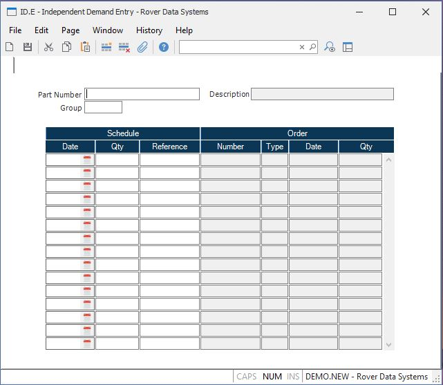

##  Independent Demand Entry (ID.E)

<PageHeader />

##

**Part Number** Enter the number of the part whose schedule is to be added or
changed.  
  
**Description** Contains the description of the associated part as it appears
in the parts master file. It is shown for information only and may not be
changed.  
  
**Group** Enter the planning group which applies to this independent demand. This field will be verified against the planning group(s) entered in [ PLAN.CONTROL ](../../PLAN-CONTROL/README.md) . If you have only one planning group this field will be defaulted and skipped.   
  
**Sch Date** Enter the dates on which the independent demand will be
scheduled.  
  
**Schedule Quantity** Enter the quantity of the part scheduled for the
associated date.  
  
**Reference** You may enter a short reference in this field to assist in
defining the reason for the scheduled date and quantity. For example, you
might want to enter the word "SPARES" if the requirement is due to the need
for spare parts. This will appear as part of the pegging in MRP.  
  
**Order Number** The order number that has satisfied this independent demand
schedule.  
  
**Order Type** The order type that has satisfied this independent demand
schedule.  
  
**Order Date** The schedule date for the order that has satisfied this
independent demand schedule.  
  
**Order Qty** The schedule quantity for the order that has satisfied this
independent demand requirement.  
  
  
<badge text= "Version 8.10.57" vertical="middle" />

<PageFooter />