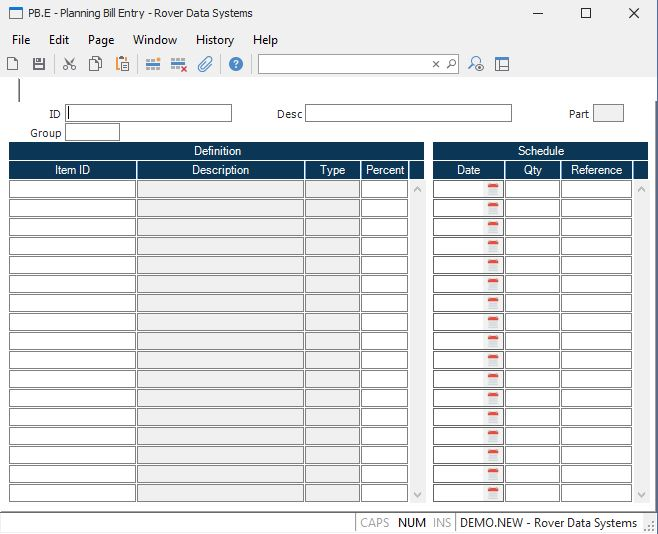

##  Planning Bill Entry (PB.E)

<PageHeader />

##

**PB.ID** Enter the identification of the planning bill you want to add or update. Planning bill IDs are user defined and may represent a logical product group or options package. If you want the system to make use of the planning bills in the [ MPS.P1 ](../../../MFG-PROCESS/MPS-P1/README.md) process then the planning bill IDs you want used must be defined on the parts master as MPS items. Please note that this not required if you are only using the planning bills as a means to load the forecast or MPS directly for the items defined within each planning bill. In this case you are only concerned with the items in the planning bill and not the planning bill itself.   
  
**Group** Enter the planning group which applies to this master schedule. This field will be verified against the planning group(s) entered in [ PLAN.CONTROL ](../../PLAN-CONTROL/README.md) . If you have only one planning group this field will be defaulted and skipped.   
  
**Description** Enter an optional one line description of the planning bill.
If a part number is used as the planning bill ID then the first line of the
part description will be loaded as the default.  
  
**Part?** Contains the word "Yes" if the associated item is defined in the
parts master, or "No" if not.  
  
**Item ID** Enter the identification of the item you want to define in the
planning bill. You may enter either a part number or the ID to another
planning bill.  
  
**Description** Contains the description of the associated item. If the item
ID is for a planning bill then the planning bill description is displayed.
Otherwise the description from the parts master will be displayed. If the item
specified is the ID to both a parts record and a planning bill, then the
planning bill description will be displayed.  
  
**Type** Contains the word "Plan" if the associated item has a planning bill
on file, "Part" if it is the ID to an item on the parts master, or "PlanPart"
if it identifies both a part and planning bill.  
  
**Percent** Enter the percentage of the scheduled quantities for the planning
bill to be applied to the item. For example, if the scheduled quantity for a
given date was 100 for the planning bill and you wanted 25 percent of that
quantity to be allocated to the item, you would enter 25.00 in this field.
This would cause a quantity of 25 to be used for the item. Normally you would
want the percentages you enter to total to 100 percent for all items, but
there may be situations in which you do not want to adhere to this
restriction. Therefore, the system does not force you to have all of the
percentages foot to 100 percent. Percentages may be entered with up to 2
decimal places (e.g. enter 33 & 1/3 percent as 33.33).  
  
**Schule Date** Enter all of the dates on which a quantity is to be scheduled
for the planning bill.  
  
**Sch Qty** Enter the quantity scheduled on the associated date.  
  
**Reference** Enter a brief reference to be associated with the schedule date
and quantity. This reference will appear in the pegging for items which
reference the planning bill. The reference is optional, but may be useful in
specifying the reason for the projected schedule quantity.  
  
  
<badge text= "Version 8.10.57" vertical="middle" />

<PageFooter />