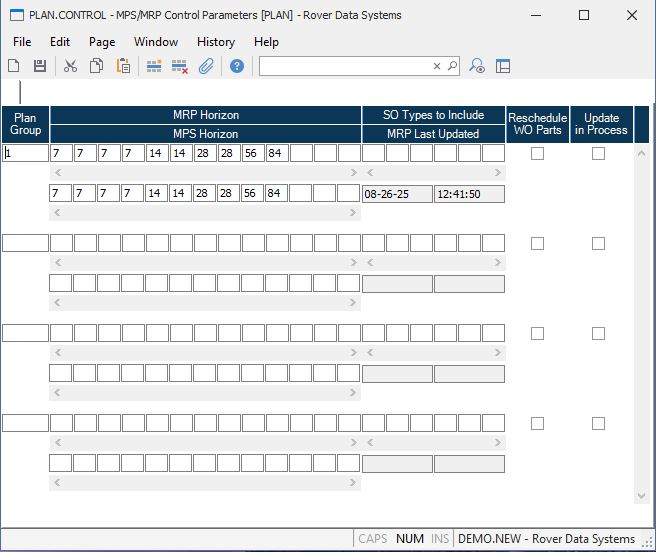

##  MPS/MRP Control Parameters (PLAN.CONTROL)

<PageHeader />

##

**Control.ID** The ID "PLAN" is pre-loaded into this field and may not be
changed.  
  
**Plan Group** Enter the planning group for which you wish to define the
horizon and valid SO types.  
  
**MRP Period Size** Enter the period size(s) (number of days) for each
"bucket" in the planning horizon.  
For example, enter "7" for a weekly period. You may enter as many periods as
you wish to see in the planning horizon.  
  
**MPS Period Size** Enter the period size(s) (number of days) for each
"bucket" in the planning horizon.  
For example, enter "7" for a weekly period. You may enter as many periods as
you wish to see in the planning horizon.  
  
**SO Types** Enter the sales order type codes which are valid for this
planning group. If any type codes  
are entered, only sales orders with a matching type code will be processed by
the planning  
module.  
  
**Reschedule Flag** Check here if you want status "N" work orders to have
their component demand rescheduled if the order needs to be expedited. Leave
blank to not reschedule.  
  
**MRP/MPS Running** If [ MRP.P1 ](../../../MFG-PROCESS/MRP-P1/README.md) or [ MPS.P1 ](../../../MFG-PROCESS/MPS-P1/README.md) is currently being run this box will be checked. After completion this will be blank. If the process is aborted, then this field will need to be cleared before rerunning. This is to prevent [ MRP.P1 ](../../../MFG-PROCESS/MRP-P1/README.md) and [ MPS.P1 ](../../../MFG-PROCESS/MPS-P1/README.md) from being run concurrently.   
  
**Last Update Date** This is the date MRP was last updated ( [ MRP.P1 ](../../../MFG-PROCESS/MRP-P1/README.md) was last run) for this plan group.   
  
**Last Update time** This is the time MRP was last updated ( [ MRP.P1 ](../../../MFG-PROCESS/MRP-P1/README.md) was last run) for this plan group.   
  
  
<badge text= "Version 8.10.57" vertical="middle" />

<PageFooter />