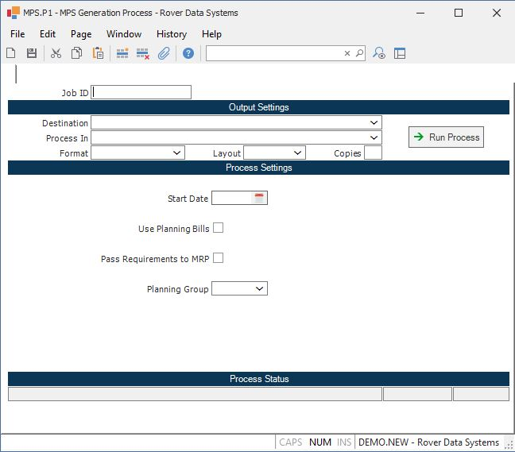

##  MPS Generation Process (MPS.P1)

<PageHeader />

##

**Job ID** Enter a unique ID if you wish to enter and save the parameters to
this procedure for future use. If you only need to run the procedure and do
not want to save your entry then you may leave this field empty.  
  
**Destination** Select the destination for the output from this procedure.  
  
**Process** Select the method to be used for processing the report. Foreground
is always available and must be used when output is directed to anything other
than a system printer (i.e. printers spooled through the database on the host
computer.) Depending on your setup there may be various batch process queues
available in the list that allow you to submit the job for processing in the
background or at a predefined time such as overnight. A system printer must be
specified when using these queues.  
  
**Format** Select the format for the output. The availability of other formats
depends on what is allowed by each procedure. Possible formats include Text,
Excel, Word, PDF, HTML, Comma delimited and Tab delimited.  
  
**Layout** You may indicate the layout of the printed page by specifying the
appropriate setting in this field. Set the value to Portrait if the page is to
be oriented with the shorter dimension (usually 8.5 inches) at the top or
Landscape if the longer dimension (usually 11 inches) is to be at the top.
Portrait will always be available but Landscape is dependent on the output
destination and may not be available in all cases.  
  
**Copies** Enter the number of copies to be printed.  
  
**Run Process** Click on the button to run the process. This performs the save
function which may also be activated by clicking the save button in the tool
bar or pressing the F9 key or Ctrl+S.  
  
**Start Date** Enter the date to be used as the start date for the first
period in the MPS horizon. The period sizes defined in the MPS.CONTROL record
are offset from this date to determine the period start and end dates for the
horizontal report.  
  
**Usa Planning Bills** Check this box if you want the MPS to be processed at
multiple levels based upon the planning bill definitions or leave it unchecked
to ignore the planning bills and process at a single level.  
Warning! If you ran the [ PB.P1 ](PB-P1/README.md) procedure to create sales forecast records and you used the explode option, you should not answer yes to this prompt because the forecast for the component items may be overstated (i.e. both a sales forecast and production forecast will be present).   
  
**Pass Requirements to MRP** The response to this prompt determines if the component demand from the master schedule is to be loaded into the MPS output file (MPSO) which may then be used by the MRP generation process [ MRP.P1 ](../../MRP-P1/README.md) . This option allows you to run the MPS without affecting the prior MPS output if desired. You might want to do this if you are attempting to resolve issues at the MPS level, but are not ready to commit any changes made to the MRP.   
  
**Planning Group** Enter the planning group for which you wish to process MPS. This field will default if there is only one planning group found in [ PLAN.CONTROL ](../../../MFG-ENTRY/PLAN-CONTROL/README.md) .   
  
**Last Status Message** Contains the last status message generated by the
program.  
  
**Last Status Date** The date on which the last status message was generated.  
  
**Last Status Time** The time at which the last status message was generated.  
  
  
<badge text= "Version 8.10.57" vertical="middle" />

<PageFooter />