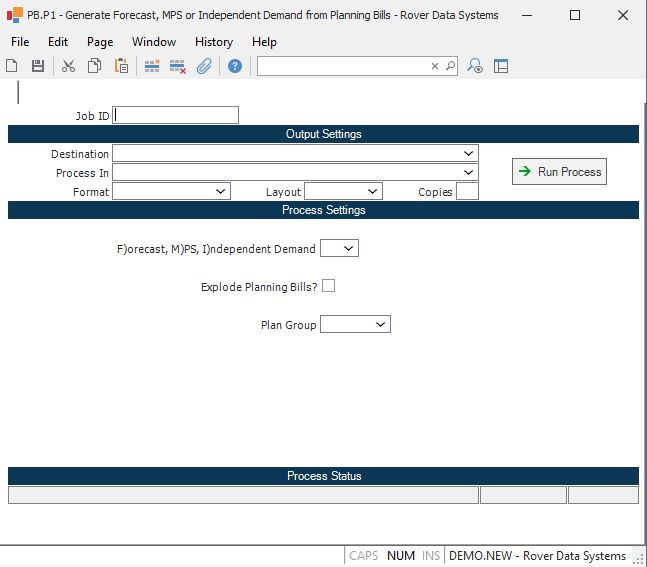

##  Generate Forecast, MPS or Independent Demand from Planning Bills (PB.P1)

<PageHeader />

##

**Job ID** Enter a unique ID if you wish to enter and save the parameters to
this procedure for future use. If you only need to run the procedure and do
not want to save your entry then you may leave this field empty.  
  
**Destination** Select the destination for the output from this procedure.  
  
**Process** Select the method to be used for processing the report. Foreground
is always available and must be used when output is directed to anything other
than a system printer (i.e. printers spooled through the database on the host
computer.) Depending on your setup there may be various batch process queues
available in the list that allow you to submit the job for processing in the
background or at a predefined time such as overnight. A system printer must be
specified when using these queues.  
  
**Format** Select the format for the output. The availability of other formats
depends on what is allowed by each procedure. Possible formats include Text,
Excel, Word, PDF, HTML, Comma delimited and Tab delimited.  
  
**Layout** You may indicate the layout of the printed page by specifying the
appropriate setting in this field. Set the value to Portrait if the page is to
be oriented with the shorter dimension (usually 8.5 inches) at the top or
Landscape if the longer dimension (usually 11 inches) is to be at the top.
Portrait will always be available but Landscape is dependent on the output
destination and may not be available in all cases.  
  
**Copies** Enter the number of copies to be printed.  
  
**Run Process** Click on the button to run the process. This performs the save
function which may also be activated by clicking the save button in the tool
bar or pressing the F9 key or Ctrl+S.  
  
**F)orecast M)PS I)ndependent Demand** Enter the letter "F" if you want the
system to generate the sales forecast from the planning bill or enter "M" if
you want to create master schedule items, or enter "I" to create independent
demand.  
  
**Explode Planning Bills** You have the option of loading the forecast or
master schedule based on the dates and quantities as they were manually
defined at each level of the planning bills, or you may choose to have the
requirements from the higher level planning bills exploded so that the
requirements for the lower level planning bills are a function of their
relationship to the higher level planning bills. Check this box if you want
the explosion to be done or leave unchecked if not.  
Warning! It is important that you do not answer yes to the "Use Planning Bills" option in [ MPS.P1 ](../../MPS-P1/README.md) if you are loading sales forecast with the explode option set to yes in this procedure. Answering yes to both options will have the effect of overstating the forecast for the lower level items (e.g. both a sales and production forecast will be shown for these items).   
  
**Plan Group** Enter the planning group that applies to the planning bill that
you wish to process.  
  
**Last Status Message** Contains the last status message generated by the
program.  
  
**Last Status Date** The date on which the last status message was generated.  
  
**Last Status Time** The time at which the last status message was generated.  
  
  
<badge text= "Version 8.10.57" vertical="middle" />

<PageFooter />