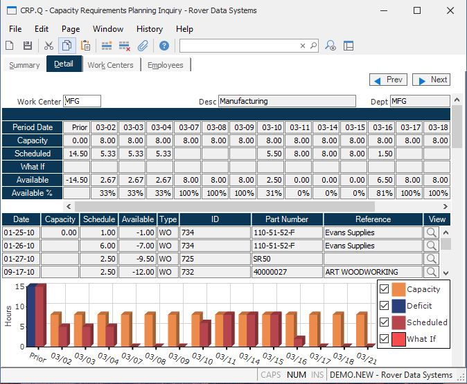

##  Capacity Requirements Planning Inquiry (CRP.Q)

<PageHeader />

##  Detail

**Work Center** Displays the name of the work center currently being viewed.  
  
**Work Center Desc** Displays a brief description of the work center.  
  
**Work Center Dept** Displays the name of the department the work center is
assigned to.  
  
**Period Date** Displays the first date for each period displayed.  
  
**Capacity Hours** Displays the available capacity for eah period.  
  
**Scheduled Hours** Displays the number of hours currently scheduled in the
period.  
  
**What If Hours** If the What If parameters have been entered the hours
required for the item entered will be shown in this field.  
  
**Available Hours** Displays the remaining hours of capacity available after
deducting the scheduled and What If hours.  
  
**Available Percent** Displays the percenatge of the capacity that is still
available. Negative numbers indicate that there is insufficient capactiy to
cover demand.  
  
**Detail Date** Contains the dates on which the associated capacity hours are
required.  
  
**Detail Capacity Hours** Contains the total capacity for the work center on
the associated date. The figure appears only on the first item of a group of
requirements which occur on the same date.  
  
**Detail Scheduled Hours** Contains the hours scheduled for the associated
item and date.  
  
**Detail Available Hours** Contains the net hours available after subtracting
the required hours for the current item. The calculation is performed by
taking the capacity hours for the date and subtracting the required hours for
each entry up to and including the current requirement. The available hours
which appear next to the last entry for the date represents the net available
for the day after subtracting all requirements.  
  
**Detail Type** Contains the type of the item defined in the associated ID
field which has the requirement. (WO = work order, PO = Planned Order, MS =
master schedule, etc.)  
  
**Detail ID** Shows the ID of the record that requires the associated hours.  
  
**Detail Part Number** Displays the part number associated with the capacity
requirement.  
  
**Detail Reference** Displays any reference information associated with the
requirement such as a customer name associated with a work order.  
  
**** Click this button to display view the details of the associated item. In the case of work orders this will invoke the work order entry procedure ( [ WO.E ](../../../../../../../../../../../../../../../../../../rover/AP-OVERVIEW/AP-ENTRY/AP-E/CHECKS-E/AP-CONTROL/GLCHART-E/GLCHART-E-1/GLCHART-R2/WO-CONTROL/WO-E) ). For master schedule items the [ MS.E ](MS-E/README.md) procedure will be invoked.   
  
**Detail Chart** Displays a chart indicating the capacity required for each
period compared with what is available.  
  
**Prev**  
  
**Next** Click this button to display the next work center.  
  
  
<badge text= "Version 8.10.57" vertical="middle" />

<PageFooter />