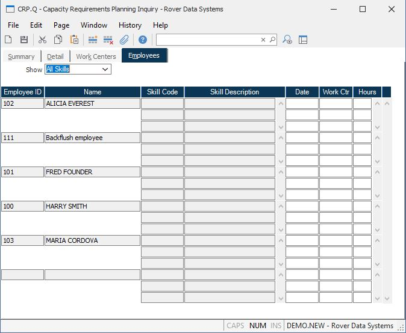

##  Capacity Requirements Planning Inquiry (CRP.Q)

<PageHeader />

##  Employees

**Emp Show** This field allows you determine which employees are included in
the display. Select "All Skills" to show all employees regardless of skill,
"What If" skills to show only those employees with the skills required by the
routing from the what if parameters, or select a specific skill to show only
employees with that skill.  
  
**Employee ID** Displays all of the employees based on the skill filter
selected in the Show field.  
  
**Emp Name** Displays the name of each employee.  
  
**Emp Skill Code** Displays all of the skill codes associated with each
employee.  
  
**Emp Skill Description** Displays the description of each of the associated
skill codes.  
  
**Emp Date** Displays the dates on which an employee is scheduled within the
associated work centers. Work centers and hours are entered in the subsequent
fields and, when totaled with the hours for other employees, generate the
total hours available for each work center. For example, if an employee was
normally scheduled to work for 8 hours in the DRILL work center you would
enter a date on or before the current date in this field, "DRILL" in the work
center field and 8 in the associated hours field. If it determined that at a
future date the employee needed to split his time between DRILL and CUT you
would enter the future date into the nect date field, DRILL and its associated
hours and then CUT and its associated hours. Then make another entry in the
date field for when the employee wuld return to only the drill work center.  
  
**Emp Work Center** Enter each work center that the employee is scheduled for
on the associated date.  
  
**Emp Hours** Enter the hours the employee is scheduled in the associated work
center. These represent daily hours.  
  
  
<badge text= "Version 8.10.57" vertical="middle" />

<PageFooter />