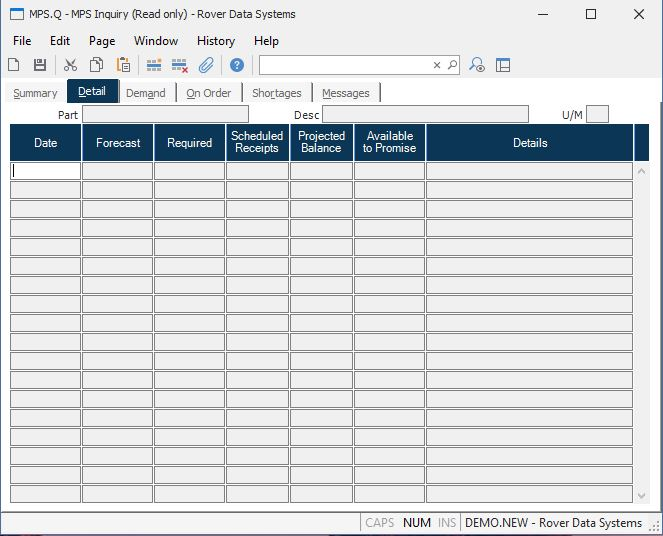

##  MPS Inquiry (MPS.Q)

<PageHeader />

##  Detail

**Date** Contains the date of the associated forecast, requirements, scheduled
receipts, and available to promise quantities.  
  
**Forecast** Contains the forecast for the part on the associated date.  
  
**Gross Requirements** Contains each requirement for the part on the
associated date.  
  
**Scheduled Receipts** Contains the scheduled receipt quantities for the
associated date.  
  
**Projected Balance** Shows the projected balance for the associated date
after all requirements, scheduled receipts and forecasts have been accounted
for.  
  
**Available To Promise** Contains the quantity which is available to promise
for customer orders until the next available to promise quantity appears.  
  
**Details** Contains a brief description of the associated requirements and
scheduled receipts. The details details may include one of the following codes  
followed by a record ID or part number...  
SO - Sales Order  
PO - Purchase Order  
WO - Work Order  
SF - Scrap Factor  
GR - Gross Requirement (indicates a part#)  
MS - Master Schedule  
  
**Part#** Displays the part number currently being inquired.  
  
**Desc** The part number description.  
  
**UM** The inventory stocking unit of measure.  
  
  
<badge text= "Version 8.10.57" vertical="middle" />

<PageFooter />