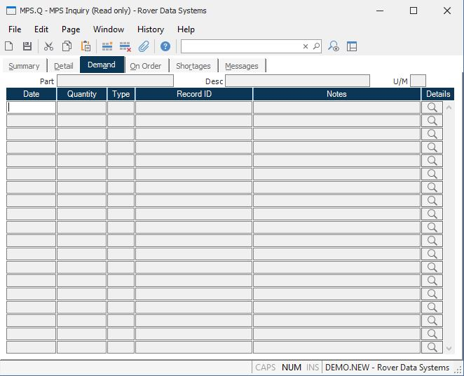

##  MPS Inquiry (MPS.Q)

<PageHeader />

##  Demand

**Pegging Date** Contains the date of the requirement generated by the
associated item.  
  
**Pegging Quantity** Contains the quantity required by the associated item.  
  
**Pegging Type** Contains the type code which defines what the associated ID
number defines. The following codes may be present...  
SO - Sales Order  
GR - Gross Requirement (indicates a part#)  
MS - Master Schedule  
  
**Pegging ID** Shows the record ID or part number of the parent item which is
driving the demand for the part.  
  
**Pegging Notes** Contains notes which further define the associated pegging
item such as the description of a part for a gross requirement.  
  
**** Click this button to view the details for the associated item in the
appropriate procedure.  
  
**Part#** Displays the part number currently being inquired.  
  
**Desc** The part number description.  
  
**UM** The inventory stocking unit of measure.  
  
  
<badge text= "Version 8.10.57" vertical="middle" />

<PageFooter />