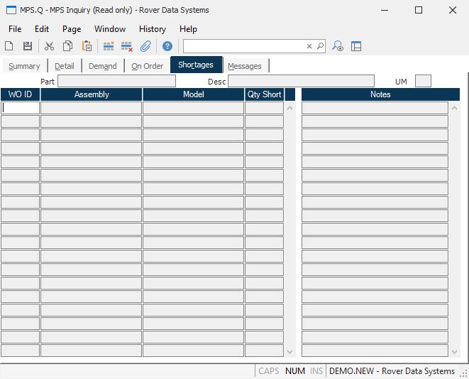

##  MPS Inquiry (MPS.Q)

<PageHeader />

##  Shortages

**Work Order Number** Shows all of the work orders which have a shortage of
the part and the quantity short.  
  
**Assembly Number** Contains the top assembly number for the associated work
order.  
  
**Model Number** Contains the model number being produced on the associated
work order.  
  
**Quantity Short** Contains the quantity short on the associated work order.  
  
**Shortage Notes** Contains the any notes which have been entered which give
further information regarding the status of the shortages.  
  
**Part#** Displays the part number currently being inquired.  
  
**Desc** The part number description.  
  
**UM** The inventory stocking unit of measure.  
  
  
<badge text= "Version 8.10.57" vertical="middle" />

<PageFooter />