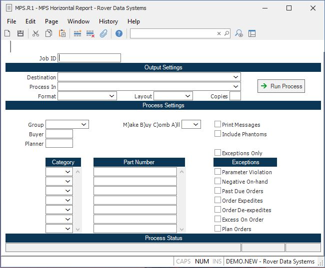

##  MPS Horizontal Report (MPS.R1)

<PageHeader />

##

**Job ID** Enter a unique ID if you wish to enter and save the parameters to
this procedure for future use. If you only need to run the procedure and do
not want to save your entry then you may leave this field empty.  
  
**Destination** Select the destination for the output from this procedure.  
  
**Process** Select the method to be used for processing the report. Foreground
is always available and must be used when output is directed to anything other
than a system printer (i.e. printers spooled through the database on the host
computer.) Depending on your setup there may be various batch process queues
available in the list that allow you to submit the job for processing in the
background or at a predefined time such as overnight. A system printer must be
specified when using these queues.  
  
**Format** Select the format for the output. The availability of other formats
depends on what is allowed by each procedure. Possible formats include Text,
Excel, Word, PDF, HTML, Comma delimited and Tab delimited.  
  
**Layout** You may indicate the layout of the printed page by specifying the
appropriate setting in this field. Set the value to Portrait if the page is to
be oriented with the shorter dimension (usually 8.5 inches) at the top or
Landscape if the longer dimension (usually 11 inches) is to be at the top.
Portrait will always be available but Landscape is dependent on the output
destination and may not be available in all cases.  
  
**Copies** Enter the number of copies to be printed.  
  
**Run Process** Click on the button to run the process. This performs the save
function which may also be activated by clicking the save button in the tool
bar or pressing the F9 key or Ctrl+S.  
  
**Group** Enter the planning group for which you wish to run this MPS report.  
  
**Buyer** If you want to restrict the listing to items which are assigned to a specific buyer, then enter the code which identifies the buyer at this prompt. The buyer is associated to the part number in the [ PARTS.E ](../../../../../rover/AP-OVERVIEW/AP-ENTRY/ACCT-CONTROL/ACCT-CONTROL-1/ar-e/PARTS-E) procedure.   
  
**Planner** If you want to restrict the listing to items which are assigned to a specific planner, then enter the code which identifies the planner at this prompt. The planner is associated to the part number in the [ PARTS.E ](../../../../../rover/AP-OVERVIEW/AP-ENTRY/ACCT-CONTROL/ACCT-CONTROL-1/ar-e/PARTS-E) procedure.   
  
**Category** Enter each part category you would like included in the report.
The categories will be printed in the order they are entered. If you want to
list all of the parts then leave this field blank. You should also leave this
field blank if you want to print only specific part numbers. These can be
specified at the next prompt.  
  
**Part Number** Enter all of the part numbers you want included in the report.
The parts will be printed in the order they are entered. If you want to print
all part numbers then leave this field blank.  
  
**C$X95** Enter one of the following letters which defines which types of
parts are to be included in the listing...  
  
M - Make parts only  
B - Buy parts only  
C - Combination make/buy  
A - All parts  
If no selection is entered then "A" is assumed. Also, any part that is not
defined as either make, buy or combination will be included.  
  
**Print Messages** Check this box if you want the MPS action messages
displayed on the report.  
  
**Include Phantoms** Check this box if you want to include phantoms in the
listing.  
  
**Exceptions Only** Check this box if you only want to print those records
which show some exception condition which is defined in the prompts that
follow.  
  
**Parameter Violation** Check this box if parameter violations are to be
included in the exception listing.  
  
**Negative On-Hand** Check this box if you want items which show a negative
balance on-hand to be included in the exception report.  
  
**Past Due Orders** Check this box if you want orders which are past due to be
included in the exception report. This applies to scheduled receipts.  
  
**Order Expedites** Check this box if parts with orders that need to be
expedited should be included in the report.  
  
**Order De-expedites** Check this box if you want parts with receipts that are
scheduled to early to be included in the report.  
  
**Excess On Order** Check this box if parts with orders for more than is
needed should be included in the report.  
  
**Plan Orders** Enter the letter "Y" if you want parts which require
additional orders to be planned to be included in the report, otherwise enter
"N".  
  
**Last Status Message** Contains the last status message generated by the
program.  
  
**Last Status Date** The date on which the last status message was generated.  
  
**Last Status Time** The time at which the last status message was generated.  
  
  
<badge text= "Version 8.10.57" vertical="middle" />

<PageFooter />