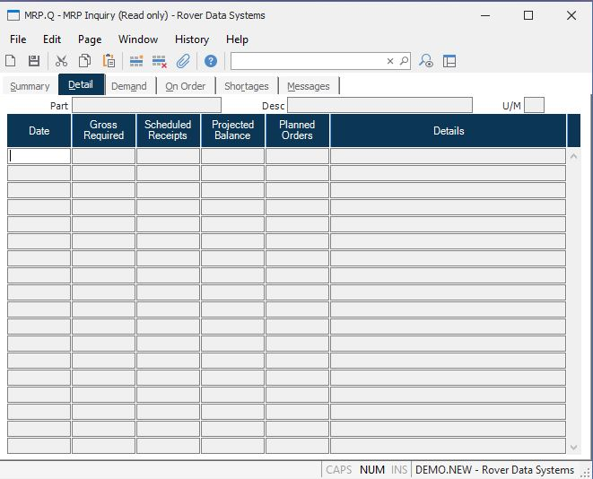

##  MRP Inquiry (MRP.Q)

<PageHeader />

##  Detail

**Date** Contains the date of the associated requirements, scheduled receipts,
and planned order quantities.  
  
**Gross Requirements** Contains each requirements for the part on the
associated date.  
  
**Scheduled Receipts** Contains the scheduled receipt quantities for the
associated date.  
  
**Projected Balance** Shows the projected balance for the associated date
after all requirements, scheduled receipts and planned orders have been
accounted for.  
  
**Planned Order Quantity** Contains the planned order quantity recommended by
the system for the associated date.  
  
**Details** Contains a brief description of the associated requirements,
scheduled receipts and planned orders. The details may include one of the
following codes followed by a record ID or part number...  
SO - Sales Order  
PO - Purchase Order  
WO - Work Order  
TP - Time Phased Order  
SC - Scrap Factor  
SS - Safety Stock  
GR - Gross Requirement (indicates a part#)  
MS - Master Schedule Item (indicates a part#)  
  
**Part#** The part number of the inquiry item.  
  
**Desc** The description of the part.  
  
**UM** The inventory stocking unit of measure.  
  
  
<badge text= "Version 8.10.57" vertical="middle" />

<PageFooter />