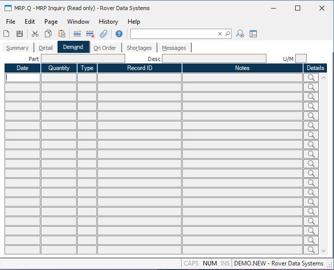

##  MRP Inquiry (MRP.Q)

<PageHeader />

##  Demand

**Pegging Date** Contains the date of the requirement generated by the
associated item.  
  
**Pegging Quantity** Contains the quantity required by the associated item.  
  
**Pegging Type** Contains the type code which defines what the associated ID
number defines. The following codes may be present...  
SO - Sales Order  
GR - Gross Requirement (indicates a part#)  
ID - Independent Demand  
MS - Master Schedule Item (indicates a part#)  
SC - Scrap Factor  
SS - Safety  
  
**Pegging ID** Shows the record ID or part number of the parent item which is
driving the demand for the part.  
  
**Pegging Notes** Contains notes which further define the associated pegging
item such as the description of a part for a gross requirement.  
  
**** Click this button to view the source of the associated demand. For
example, if the Type contains "GR" (Gross Requirement) then the MRP.Q
procedure will be launched for the associated part number. If the Type is "SO"
the sales order entry process will be launched.  
  
**Part#** The part number of the inquiry item.  
  
**Desc** The description of the part.  
  
**UM** The inventory stocking unit of measure.  
  
  
<badge text= "Version 8.10.57" vertical="middle" />

<PageFooter />