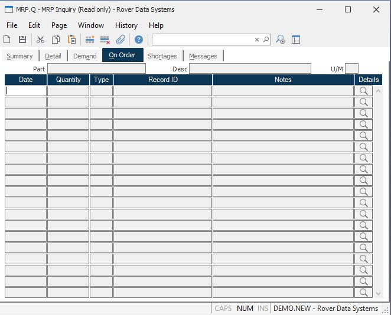

##  MRP Inquiry (MRP.Q)

<PageHeader />

##  On Order

**Order Details Date** Contains the date when the associated scheduled receipt
is due.  
  
**Order Details Quantity** Contains the quantity scheduled on the associated
date.  
  
**Order Details Type** Contains the type code which defines what the
associated ID number defines. The following codes may be present...  
PO - Purchase Order  
WO - Work  
  
**Order Details ID** Shows the record ID of the purchase order or work order
which is scheduled on the associated date.  
  
**Order Detail Notes** Contains notes which further define the associated
order details such as the name of the vendor on an associated purchase order.  
  
**** Click this button to view the associated purchase order or work order.  
  
**Part#** The part number of the inquiry item.  
  
**Desc** The description of the part.  
  
**UM** The inventory stocking unit of measure.  
  
  
<badge text= "Version 8.10.57" vertical="middle" />

<PageFooter />