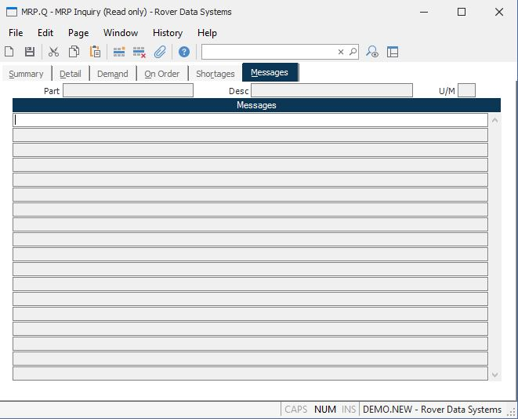

##  MRP Inquiry (MRP.Q)

<PageHeader />

##  Messages

**Messages** Contains the exception messages generated during the MRP
processing.  
  
**Part#** The part number of the inquiry item.  
  
**Desc** The description of the part.  
  
**UM** The inventory stocking unit of measure.  
  
  
<badge text= "Version 8.10.57" vertical="middle" />

<PageFooter />