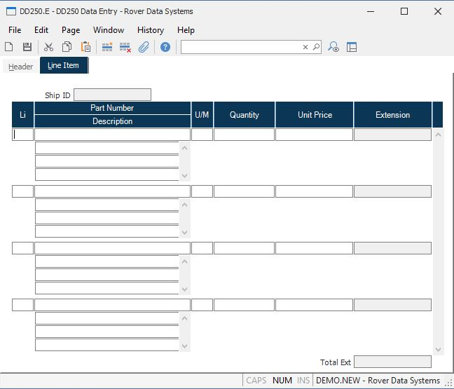

##  DD250 Data Entry (DD250.E)

<PageHeader />

##  Line Item

**Ship ID** This field contains the shipment ID from screen 1.  
  
**Li** This field contains the line item from the SHIP record.  
  
**Part** The part being shipped on this line item.  
  
**T$X205** This field contains the description, as loaded from the SHIP file,
or the PARTS file. Changes  
may be made as required. Any changes will not be reflected on the SHIP record.  
  
**UM** The unit of measure being shipped.  
  
**Qty** The quantity being shipped on this line item.  
  
**Unit.Price** The unit price of the part being delivered.  
  
**Extension** The extended value of the line item (Quantity X Unit Price).  
  
**Total** The total extended value of the shipment line items.  
  
  
<badge text= "Version 8.10.57" vertical="middle" />

<PageFooter />