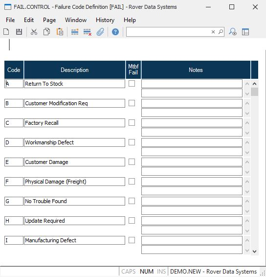

##  Failure Code Definition (FAIL.CONTROL)

<PageHeader />

##

**Control ID** The ID "FAIL" is automatically entered and is the only vaild ID
for this procedure.  
  
**Code** Enter the 4 digit code which will be used as the identifier for the
associated failure definition.  
  
**Description** Enter the description of the coresponding failure code.  
  
**MTBF Fail** Check this box if the the associated failure code signifies a
failure of the product which should be included in the MTBF (mean time between
failure) calculation.  
  
**Notes** Enter any applicable notes which further define or clarify the
meaning of the associated failure code.  
  
  
<badge text= "Version 8.10.57" vertical="middle" />

<PageFooter />