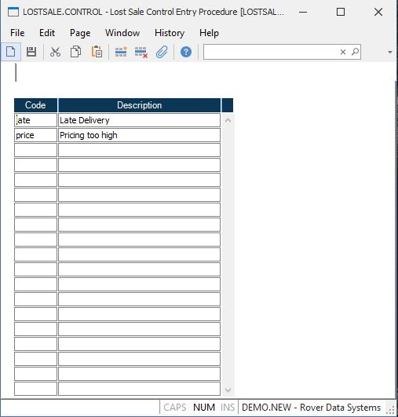

##  Lost Sale Control Entry Procedure (LOSTSALE.CONTROL)

<PageHeader />

##

** **  
  
**Reason Code** Enter up to a 6 digit code which will be used as the identifier for the associated lost sale. Lost sales can be tracked via [ LOSTSALE.E ](../../../../../rover/MRK-OVERVIEW/MRK-ENTRY/LOSTSALE-CONTROL/LOSTSALE-E) .   
  
**Code Description** Enter the description for the associated code.  
  
  
<badge text= "Version 8.10.57" vertical="middle" />

<PageFooter />