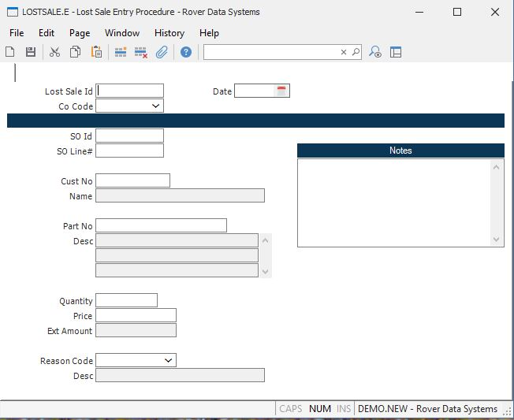

##  Lost Sale Entry Procedure (LOSTSALE.E)

<PageHeader />

##

**Lost Sale Id** The number of the transaction. For new transactions, this
number will be automatically assigned when the record is filed.  
  
**Co Code** Enter the company code that this record should be applied to. The
company code must be predefined in the CO.CONTROL procedure. If only one
company code exists, it will automatically be inserted into this record for
you.  
  
**Date** Enter the date on which the sale was lost. The current date is
defaulted.  
  
**Customer** Enter the customer number for this transaction.  
  
**Customer Name** The name of the customer as defined in [ cust.e ](../../../../../../rover/AP-OVERVIEW/AP-ENTRY/ACCT-CONTROL/ACCT-CONTROL-1/ar-e/AR-E-1/CASH-E/recon-e/RECON-E-2/CASH-E4/CASH-E4-1/cust-e) . The name is displayed for reference only and cannot be changed.   
  
**Part No** Enter the part number for which an order was not placed.  
  
**Part Description** The description of the part as defined in [ parts.e ](../../../../../../rover/AP-OVERVIEW/AP-ENTRY/AP-E/AP-E-1/CURRENCY-CONTROL/PO-E/PO-E-1/po-control/PO-CONTROL-1/parts-e) . The description of the part is displayed for reference only and cannot be changed.   
  
**Qty** Enter the quantity of the part number that was not ordered.  
  
**Price** Enter the unit.price that this part was to have been sold at.  
  
**Extended Amount** This field contains the total amount (qty * price) that
was to have been sold to the referenced customer. This field is for reference
only and cannot be changed.  
  
**Code** Enter the reason code that this sale was lost.  
  
**Reason Code Description** The description for the associated reason code.
This description is displayed for reference only and cannot be changed.  
  
**Notes** Enter any miscellaneous notes for this transaction.  
  
  
<badge text= "Version 8.10.57" vertical="middle" />

<PageFooter />