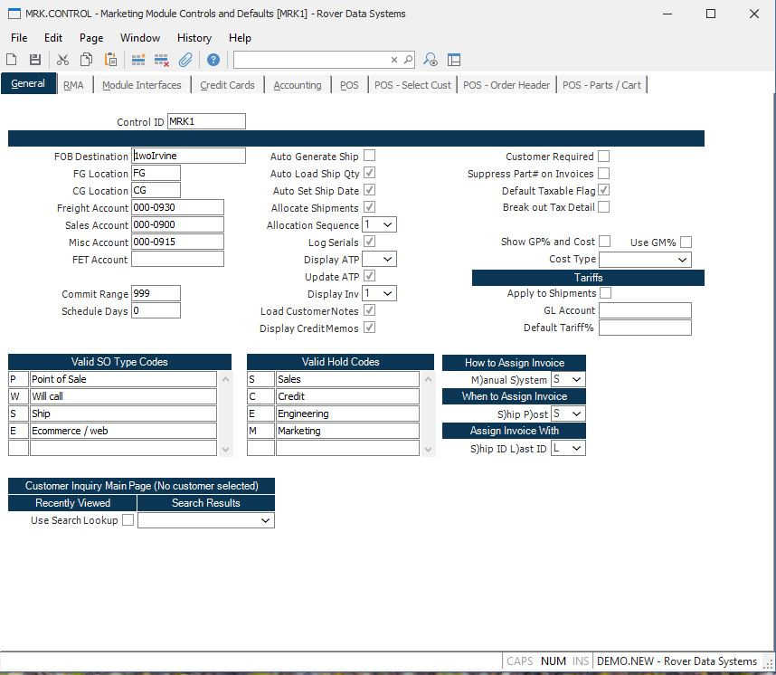

##  Marketing Module Controls and Defaults (MRK.CONTROL)

<PageHeader />

##  General

**Control ID** The control id is the company code (as defined on screen 2 of
CO.CONTROL) preceded by "MRK". If you only have one company code the control
id will automatically be inserted into this procedure for you. If you have
multiple company codes you may select from a list of available companies or
you may enter the id directly e.g. MRK2. This record contains the default
information used in the MRK module by company code.  
  
**FOB Dest** Enter the default FOB information which can be defaulted into the
Sales Order entry procedure.  
  
**FG Location** Enter the INVLOC which can be defaulted into the shipment
record.  
  
**CG Location** Enter the default Cost of Goods inventory location (INVLOC)
which can be used in the shipping process.  
  
**Freight Acct#** Enter the default General Ledger account which can be used
for the freight amount in the shipping process.  
  
**Sales Acct#** Enter the default General Ledger account number which can be
used as the Sales account for the Marketing module.  
  
**Misc Acct#** Enter the default General Ledger account number which can be
used for miscellaneous charges by the shipping process.  
  
**FET Account:** Enter the General Ledger account number which will used when a Federal Excise Tax (FET) charge is posted via [ SHIP.P1 ](../../../MRK-PROCESS/SHIP-P1/README.md) .   
  
**Commit Range** The information in this field is used to determine which
scheduled quantities on a new sales order are to be defaulted to the "commit"
status. The entry in this field should be a number representing the number of
days to be added to the current system date at the time of order entry. The
resulting date is used as the cut-off for setting the commit status on a given
schedule date. If the schedule date is less than or equal to the cut-off date
the associated quantity will be commited. If you do not want commitments to be
set automatically then leave this field blank.  
  
**Sched Days** This field determines if scheduled dates are to be defaulted in
sales order entry, and the date to be used as the default. If a number is
present in this field then the system will use this as the number of days to
add to the current date in setting the date to be loaded automatically. If you
always want to default the current date then you would enter "0" into this
field. Leave the field blank if you do not want a default date to be
automatically loaded.  
  
**Valid SO Type** Define valid SO type codes and their descriptions for use in sales order entry. If any type codes are entered here, they will be used in [ SO.E ](../../SO-E/README.md) for lookup and validation.   
  
**SO Type Code Description** Enter the description of the associated type code for display/lookup purposes in [ SO.E ](../../SO-E/README.md) .   
  
**Hold Code** Define valid SO hold codes and their descriptions for use in sales order entry. If any hold codes are entered here, they will be used in [ SO.E ](../../SO-E/README.md) for lookup and validation.   
  
**Hold Code Description** Enter a description for the associated hold code.  
  
**Auto Generate Ship** If you wish to have the [ SO.E ](../../SO-E/README.md) process automatically call the [ SHIP.E ](../../SHIP-E/README.md) allocation process, then check this box.   
  
**Auto Load Ship Qty** If you wish to have the open sales order quantity
automatically loaded in the shipment entry procedures, check this box.  
  
**Auto Set Ship Date** This field allows you to set a flag that will auto set the ship date in [ SHIP.E2 ](SHIP-E2/README.md) when the status field is changed from "N" to "S".   
  
**Allocate Shipments** Check this box if the items specified on shipments are
to be allocated in inventory.  
  
**Allocation Sequence** Enter one of the following numbers which defines the
method used for automatically allocating lots for items to be shipped.  
  
0\. Do not automatically assign lot numbers.  
1\. Use oldest lots first regardless of  
available quantity.  
2\. Use the lot that has the smallest available  
quantity that still meets the quantity  
required.  
Unless you have part numbers that are lot controlled you should always set
this field to 0.  
  
**Log Serials** This field will control whether serial number information is
written into the SERIAL file when shipments and/or returns are processed. If
this field is not set to 'Y', serial number may still be entered, but will not
update the serial number tracking file.  
  
**Display ATP** This field controls the display of ATP during the [ SO.E ](../../SO-E/README.md) procedure. Enter a zero "0" to skip the display of ATP. An entry of "1" will display ATP for all planning groups. An entry of "2" will cause a display of only the planning group which matches the FG (pull) location on the line of the sales order.   
  
**Update ATP** Check this box if you want the available to promise in MPS to be updated automatically after the sales order is filed in [ SO.E ](../../SO-E/README.md) .   
  
**Display Inv** Enter a zero if you do not wish to display the inventory status for the specified part number in [ SO.E ](../../SO-E/README.md) If you wish to display the inventory status enter one of the following:   
  
"1" to display the inventory status on the entered part number only.  
  
"2" to display the inventory status on the entered part number and the first
level of the bill of material.  
  
"3" to display the inventory status on the entered part number and all levels
of the bill of material.  
  
**Load Customer Notes** Check this box if you wish to load the customer notes from the "general" tab in [ CUST.E ](../../../../AR-OVERVIEW/AR-ENTRY/CUST-E/README.md) into the sales order via [ SO.E ](../../SO-E/README.md) . If checked, these notes will be loaded into the sales orders after entry of the customer number on new records.   
  
**Display Credit Memos** Check this box if you wish to display open credit memos upon entry of the customer number on new records in [ SO.E ](../../SO-E/README.md) . This will display a list box from which the user can select one or more credit memos to apply to the sales order balance. The credit memos will still be displayed on the ship/tax/credit tab of [ SO.E ](../../SO-E/README.md) regardless of this setting.   
  
**Default taxable flag** Checking this box controls the taxable flag default in both [ SOQUOTE.E ](SOQUOTE-E/README.md) and [ SO.E ](../../SO-E/README.md) . When this box is checked and a sales tax percentage is non-zero and a line item is entered, the taxable flag will default to "Y" (checked) automatically. You will need to remove the check from any line items that should not be taxable manually. If it is not checked, then the user is responsible for deciding what lines items are taxable.   
  
If you use this field, then the taxable flag in [ PARTS.E ](../../../../ENG-OVERVIEW/ENG-ENTRY/PARTS-E/README.md) will be ignored.   
  
**Assign Invoice (How)** Enter the letter "M" if invoice numbers are to be
assigned manually at shipment time, or enter "S" if they are to be assigned by
the system. If the field is left blank then "S" is assumed.  
  
**Assign Invoice (When)** Enter the letter "S" if the invoice number is to be
assigned by the system at the time the shipment is filed, or "P" to assign the
number when the shipment is posted.  
  
**Assign Invoice (With)** Enter the letter "S" if the invoice number is to be
assigned the same number as the shipment, or enter "L" if the number should be
assigned as the next sequential number from the LIID file.  
  
  
<badge text= "Version 8.10.57" vertical="middle" />

<PageFooter />